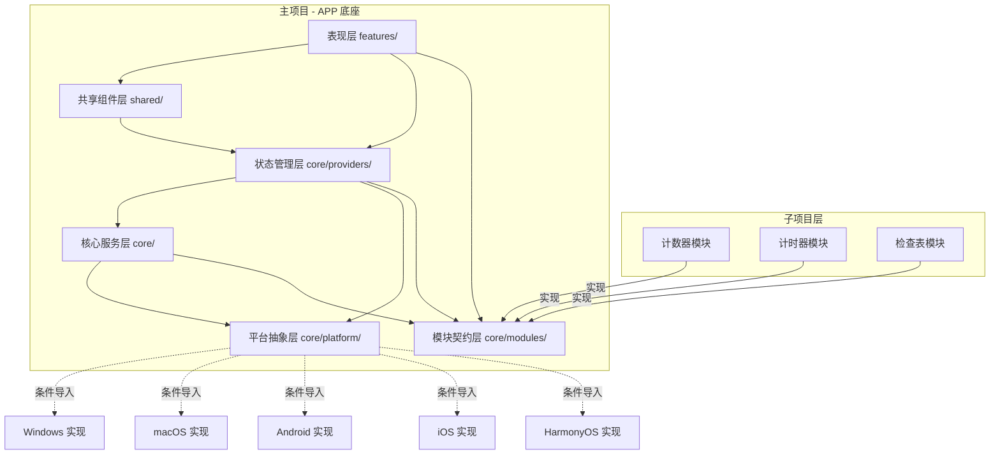
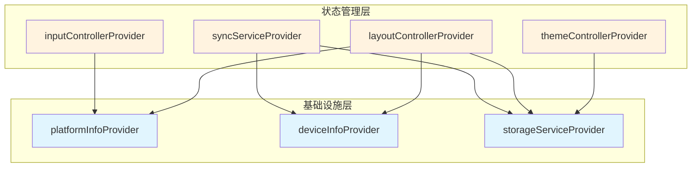
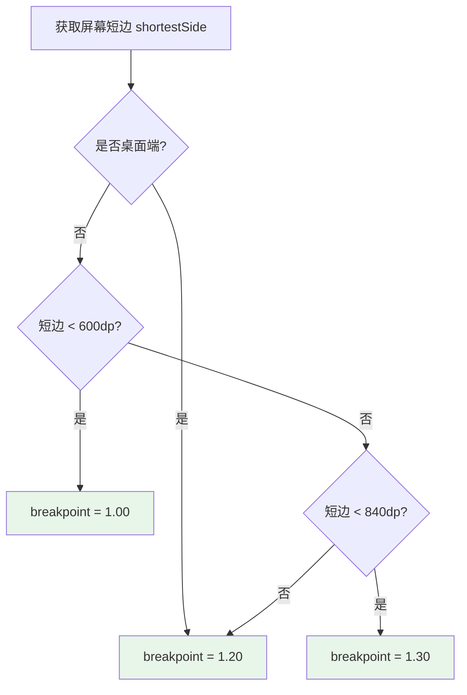
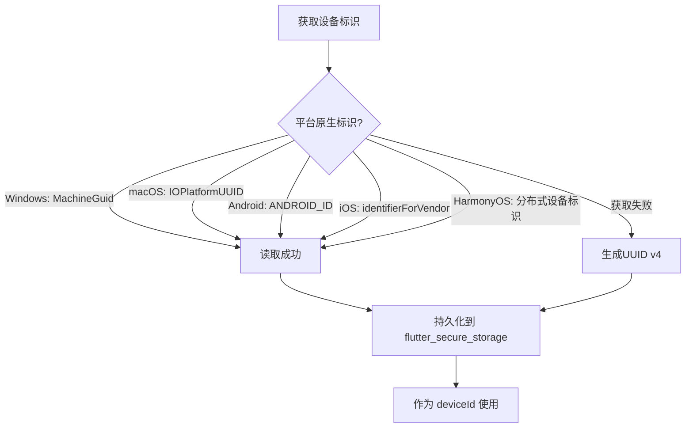

# AMEToolbox 设计规范

> **文档类型**: 设计规范 (Design Specification)
> **版本**: v1.0
> **日期**: 2026-07-28
> **基于**: `modular_tool_app_spec.md` v0.7 + `project_constraints.md` v1.0
> **面向**: 开发者、AI Agent、架构师
> **状态**: 已定稿

---

## 1. 设计概览

### 项目名称

**AMEToolbox**（模块化工具 APP）—— 面向工厂工人及管理者的模块化工具应用。用户按岗位需要自行启用功能模块，通过 WebDAV 实现无账号体系下的数据同步，全面适配工厂多样的硬件环境与光照条件。

### 设计原则列表

| 编号 | 原则 | 说明 |
|------|------|------|
| DP-01 | **契约优先** | 底座定义接口契约，子项目遵守契约独立开发。接口是双方唯一的交互边界，任何变更须经双方确认 |
| DP-02 | **平台无关的 UI 层** | `lib/features/` 和 `lib/shared/` 下的所有 Widget 代码不含任何平台判断或平台 API 调用，平台差异通过抽象层注入 |
| DP-03 | **自适应优于自定义** | 输入模式、布局模式、DPI 缩放均优先采用自动检测策略，用户可手动覆盖但不要求手动配置 |
| DP-04 | **Agent 驱动开发友好** | 选型优先考虑编译时安全、类型安全、依赖关系显式、可独立测试，降低 Agent 协作中的错误率 |
| DP-05 | **渐进式多平台** | 以 Windows 为首发展开验证，UI 层从第一天起保持平台无关性，后续平台移植仅需补全抽象层实现 |
| DP-06 | **数据归属 WebDAV 账号** | 无内置用户体系，数据以 WebDAV 账号维度存储和同步；同一 WebDAV 账号下的所有设备共享同一套 APP 数据 |
| DP-07 | **MD3 一致性** | 所有视觉和交互严格遵循 Material Design 3 规范，不做自定义视觉样式，确保跨模块体验统一 |

### 设计约束摘要

以下为刚性约束（引自 `project_constraints.md` 第 2 节），设计决策不得违反：

| 约束ID | 约束名称 | 要求 |
|--------|----------|------|
| C-001 | UI 设计规范 | Google Material Design 3 (MD3) |
| C-002 | 技术架构 | Flutter 跨平台框架 |
| C-003 | 多平台支持 | Windows、macOS、HarmonyOS、Android、iOS，Windows 首发 |
| C-004 | 输入方式适配 | 触控 + 键鼠双模式自动切换 |
| C-005 | UI 可移植性 | UI 层与平台层完全解耦，通过抽象层注入 |
| C-006 | 用户体系 | 无内置用户体系；数据以 WebDAV 账号维度存储，同一 WebDAV 账号下的设备共享数据 |
| C-007 | 数据同步 | WebDAV 协议 (RFC 4918)，支持自建服务器 |
| C-008 | 状态管理 | Riverpod（ConsumerWidget + ref.watch/read） |
| C-009 | 布局适配 | 响应式断点机制，使用底座 ResponsiveBuilder |
| C-010 | 数据存储 | 通过 StorageService 抽象接口，不得直接访问底层 |

---

## 2. 架构设计

### 2.1 整体架构

#### 主项目 + 子项目分层架构说明

项目采用**主项目（APP 底座）+ 子项目（功能模块）**的分层架构。底座提供运行时基础设施和模块契约，子项目实现具体业务功能，双方通过 `ModuleContract` 接口解耦。

**分层逻辑**（从上至下）：

1. **表现层** (`lib/features/`)：各功能页面和主页，纯 UI 代码，无平台依赖
2. **共享组件层** (`lib/shared/`)：自适应组件、工具函数，供表现层和子项目复用
3. **状态管理层** (`lib/core/providers/`)：Riverpod Provider 定义，全局状态的唯一入口
4. **核心服务层** (`lib/core/`)：主题、布局、输入、存储、同步、模块管理等核心能力
5. **平台抽象层** (`lib/core/platform/`)：平台信息和设备信息的抽象接口与各平台实现
6. **模块契约层** (`lib/core/modules/`)：`ModuleContract` 接口定义和模块注册表
7. **子项目层** (`modules/`)：各功能模块独立实现，仅依赖契约层和共享组件层

#### 依赖方向图



**依赖方向规则**：
- 上层可以依赖下层，下层不能反向依赖上层
- 子项目只能依赖模块契约层和共享组件层，不能直接访问核心服务层的实现
- 表现层和共享组件层不得依赖平台抽象层的实现类，只能通过 Provider 注入的接口访问
- 平台抽象层通过条件导入在编译期选择实现，对上层完全透明

#### 各层职责说明

| 层级 | 目录 | 职责 | 不做什么 |
|------|------|------|----------|
| 表现层 | `lib/features/` | 页面布局、用户交互、状态展示 | 不包含业务逻辑、不直接访问存储、不做平台判断 |
| 共享组件层 | `lib/shared/` | 自适应组件、通用工具函数 | 不包含页面级状态、不包含业务逻辑 |
| 状态管理层 | `lib/core/providers/` | Provider 声明、状态注入 | 不实现具体业务逻辑，仅声明依赖和暴露接口 |
| 核心服务层 | `lib/core/` | 主题、布局、输入、存储、同步、模块管理的业务实现 | 不直接操作 Widget、不包含平台专有代码 |
| 平台抽象层 | `lib/core/platform/` | 平台信息和设备信息的抽象与实现 | 不包含业务逻辑、不向 UI 层暴露实现类 |
| 模块契约层 | `lib/core/modules/` | 定义 ModuleContract 接口、维护模块注册表 | 不实现任何模块功能 |
| 子项目层 | `modules/` | 实现具体业务功能模块 | 不访问底座私有实现、不使用平台专有 API |

### 2.2 模块契约设计

#### ModuleContract 接口设计意图

`ModuleContract` 是底座与子项目之间的唯一交互契约，其设计目标是：

1. **解耦**：底座不需要知道模块的内部实现，模块也不需要知道底座的内部结构
2. **标准化**：所有模块遵循统一的生命周期和数据接口，便于底座统一管理
3. **可扩展**：新增模块只需实现接口并注册，不影响底座其他代码
4. **可测试**：接口明确，便于单元测试和集成测试

#### 接口方法的设计理由

| 方法/属性 | 为什么存在 | 设计考量 |
|-----------|-----------|----------|
| `definition` | 底座需要知道模块的基本信息以展示在导航栏和模块管理页 | 纯数据属性，无副作用，底座启动时即可读取 |
| `buildPage()` | 模块主页是用户进入模块后的主要交互界面 | 返回 ConsumerWidget，确保模块可通过 ref 访问底座状态；接收 context 和 ref 两个参数，明确依赖注入 |
| `summary` | 主页卡片需要展示模块的关键数据摘要，用户无需进入模块即可概览 | 同步返回，避免异步加载导致的卡片闪烁；轻量级数据，不包含详细记录 |
| `initialize(storage)` | 模块需要在应用启动时加载本地持久化数据 | 接收 StorageService 参数，模块不得自行访问底层存储；异步执行，底座可并行初始化多个模块 |
| `dispose()` | 模块被关闭或卸载时需要释放资源（定时器、监听器等） | 与 initialize 对称，保证生命周期完整 |
| `exportData()` | WebDAV 同步需要统一收集各模块的数据 | 返回 Map 结构，底座统一序列化；模块自行决定哪些数据需要同步 |
| `importData(data)` | 从 WebDAV 恢复数据时需要将数据注入各模块 | 与 exportData 对称，保证往返一致性；模块自行处理数据迁移和兼容性 |

#### 子项目接入流程

```mermaid
flowchart LR
    A[Step 1<br/>需求编写] --> B[Step 2<br/>接口对齐]
    B --> C[Step 3<br/>独立开发]
    C --> D[Step 4<br/>集成测试]
    D --> E[Step 5<br/>验收发布]

    A -->|产出| README.md
    B -->|确认| ModuleContract实现方案
    C -->|实现| <module>_module.dart
    D -->|注册| module_registry.dart
    E -->|递增| App版本PATCH
```

**接入要点**：
1. 子项目代码位于 `modules/<module_id>/` 目录
2. 入口类实现 `ModuleContract` 接口
3. 在 `module_registry.dart` 的 `registerAll()` 方法中注册
4. 模块数据存储使用命名空间前缀 `module_<id>_*`
5. 通过 `StorageService` 抽象接口进行数据读写

### 2.3 平台抽象设计

#### 为什么需要平台抽象层

项目需要支持 5 个平台（Windows、macOS、Android、iOS、HarmonyOS），且要求 UI 层代码完全平台无关。如果直接在 UI 层使用 `Platform.is*` 或 `dart:io`，会导致：

- **可移植性差**：每新增一个平台需要修改大量 UI 代码
- **测试困难**：平台判断散落在各处，难以模拟不同平台
- **Agent 协作风险**：Agent 可能不经意间引入平台专有代码，违反约束

通过平台抽象层，将所有平台相关代码集中在 `lib/core/platform/` 下，UI 层通过接口访问平台能力，实现关注点分离。

#### PlatformInfo + DeviceInfoProvider 双层抽象的设计理由

平台抽象分为两层，职责不同：

| 抽象层 | 接口 | 职责 | 粒度 |
|--------|------|------|------|
| 第一层 | `PlatformInfo` | 提供运行平台的分类信息（是什么平台、桌面端还是移动端、默认输入模式） | 粗粒度，平台级分类 |
| 第二层 | `DeviceInfoProvider` | 提供具体的设备和系统信息（设备ID、OS版本、DPI、设备型号、输入能力） | 细粒度，设备级详情 |

**分层理由**：

1. **关注点分离**：`PlatformInfo` 回答"在哪种平台上运行"，用于高层逻辑分支（如默认输入模式、自动 DPI 策略）；`DeviceInfoProvider` 回答"这台设备的具体参数是什么"，用于精确计算（如 DPI 缩放、断点判定）
2. **依赖最小化**：大部分场景只需要 `PlatformInfo` 的粗粒度信息，无需引入设备详情，降低依赖复杂度
3. **实现复杂度差异**：`PlatformInfo` 实现简单（基于 `dart:io` 的 Platform 枚举），`DeviceInfoProvider` 实现复杂（需要调用各平台原生 API），分层后便于渐进式实现
4. **可测试性**：测试时可以只 mock `PlatformInfo`，不需要构造完整的设备信息

#### 条件导入实现模式

使用 Dart 的**条件导入**（conditional import）机制，在编译期根据平台选择实现类：

```dart
// lib/core/platform/device_info_provider.dart
export 'device_info_provider_interface.dart'
    if (dart.library.io) 'device_info_provider_factory.dart';
```

**工厂模式**：

```dart
// device_info_provider_factory.dart
DeviceInfoProvider createDeviceInfoProvider() {
  if (kIsWeb) return WebDeviceInfoProvider();
  if (Platform.isWindows) return WindowsDeviceInfoProvider();
  if (Platform.isMacOS) return MacosDeviceInfoProvider();
  if (Platform.isAndroid) return AndroidDeviceInfoProvider();
  if (Platform.isIOS) return IosDeviceInfoProvider();
  throw UnsupportedError('Unsupported platform');
}
```

**设计要点**：
- 工厂方法仅在 `dart.library.io` 可用时编译，Web 平台回退到接口定义
- 各平台实现类独立文件，互不引用
- Riverpod Provider 在运行时调用工厂方法获取实例，上层通过接口访问
- 新增平台只需添加实现类并在工厂方法中增加分支，不影响上层代码

---

## 3. 状态管理设计

### 3.1 为什么选择 Riverpod

#### 与 Provider / Bloc / GetX 的对比决策

| 维度 | Riverpod | Provider | Bloc | GetX |
|------|----------|----------|------|------|
| 编译时安全 | 是（Provider 类型在编译期检查） | 否（运行时查找，类型错误运行时才暴露） | 是 | 否（依赖字符串 key 查找） |
| 依赖 BuildContext | 不需要（ref 直接访问） | 需要（必须在 Widget 树中） | 需要 | 不需要（全局静态访问） |
| 依赖关系显式 | 是（ref.watch 链式声明，依赖图清晰） | 部分（依赖注入不直观） | 是（Bloc 依赖明确） | 否（隐式全局依赖） |
| 独立可测试 | 是（ProviderContainer 可脱离 Widget 测试） | 否（必须构建 Widget 树） | 是 | 困难（全局状态难以隔离） |
| 代码量 | 中等 | 少 | 多（事件+状态+Bloc 三类文件） | 少 |
| 学习曲线 | 中等 | 低 | 高 | 低 |
| Agent 协作友好度 | 高（类型错误编译期发现，依赖关系一目了然） | 中 | 中（模板代码多，易出错） | 低（全局状态副作用难以追踪） |

#### Agent 驱动开发的适配性

选择 Riverpod 的核心考量是**Agent 驱动开发**的场景特点：

1. **编译时安全降低错误率**：Agent 编写代码时，类型错误在编译期即可发现，减少运行时调试成本。Provider 的类型签名是契约，Agent 按契约调用即可
2. **无需 BuildContext 简化逻辑**：Agent 在 `core/` 层编写 Controller 时，不需要理解 Flutter 的 Widget 树上下文，直接通过 ref 访问其他 Provider，心智模型更简单
3. **依赖图显式便于理解**：新加入的 Agent 只需查看 Provider 定义和 `ref.watch` 调用，就能理清各模块间的依赖关系，降低认知负荷
4. **autoDispose 防止内存泄漏**：Agent 编写代码时可能疏忽资源释放，autoDispose 机制自动处理，减少常见错误
5. **独立可测试加速验证**：Agent 可以通过 ProviderContainer 单独测试某个 Provider 的逻辑，不需要构建完整的 Widget 树，提高迭代效率

### 3.2 Provider 分层

#### 全局 Provider 清单

| Provider | 所在文件 | 类型 | 职责 |
|----------|----------|------|------|
| `platformInfoProvider` | `platform_provider.dart` | `Provider<PlatformInfo>` | 注入平台信息抽象实例 |
| `deviceInfoProvider` | `platform_provider.dart` | `Provider<DeviceInfoProvider>` | 注入设备信息抽象实例 |
| `storageServiceProvider` | `storage_provider.dart` | `Provider<StorageService>` | 注入存储服务实例 |
| `themeControllerProvider` | `theme_provider.dart` | `ChangeNotifierProvider<ThemeController>` | 主题状态管理（明暗、强调色、字体缩放） |
| `layoutControllerProvider` | `layout_provider.dart` | `ChangeNotifierProvider<LayoutController>` | 布局状态管理（横竖屏模式、断点、DPI） |
| `inputControllerProvider` | `input_provider.dart` | `ChangeNotifierProvider<InputController>` | 输入模式状态管理（触控/键鼠） |
| `syncServiceProvider` | `sync_provider.dart` | `ChangeNotifierProvider<SyncService>` | 同步服务状态管理（同步状态、配置） |

#### 每个 Provider 的职责和状态范围

**platformInfoProvider**
- **职责**：提供当前运行平台的分类信息
- **状态范围**：全局只读，应用启动时确定，运行时不变
- **依赖**：无
- **消费者**：layoutController、inputController、其他需要区分桌面/移动的逻辑

**deviceInfoProvider**
- **职责**：提供当前设备的详细信息
- **状态范围**：全局只读，应用启动时确定，运行时不变
- **依赖**：无（通过条件导入工厂创建）
- **消费者**：layoutController（自动 DPI）、syncService（设备标识）

**storageServiceProvider**
- **职责**：提供本地持久化存储服务
- **状态范围**：全局单例，数据变化通过方法调用触发
- **依赖**：无
- **消费者**：themeController、layoutController、syncService、各模块

**themeControllerProvider**
- **职责**：管理主题相关状态（明暗模式、强调色、字体缩放）
- **状态范围**：全局可变，用户通过设置页修改
- **依赖**：storageServiceProvider（持久化）
- **消费者**：MaterialApp、所有页面

**layoutControllerProvider**
- **职责**：管理布局相关状态（横竖屏模式、断点值、DPI 缩放）
- **状态范围**：全局可变，随窗口/屏幕尺寸实时变化
- **依赖**：storageServiceProvider（持久化配置）、platformInfoProvider（自动断点策略）、deviceInfoProvider（自动 DPI）
- **消费者**：ResponsiveBuilder、所有页面

**inputControllerProvider**
- **职责**：管理当前输入模式（触控/键鼠）
- **状态范围**：全局可变，随用户输入设备动态切换
- **依赖**：platformInfoProvider（默认输入模式）
- **消费者**：InputModeScope、所有自适应组件

**syncServiceProvider**
- **职责**：管理 WebDAV 同步服务
- **状态范围**：全局可变，同步进行中状态实时更新
- **依赖**：storageServiceProvider（读写数据）、deviceInfoProvider（设备标识）
- **消费者**：设置页、主页同步状态卡片

#### Provider 依赖关系图



### 3.3 状态更新模式

#### ChangeNotifier 模式的使用场景

**适用场景**：
- 状态包含多个相关属性，需要原子性更新（如 ThemeConfig 同时包含 mode、accentColor、fontScale）
- 状态变更有复杂的业务逻辑（如 LayoutController 需要根据 MediaQuery 计算断点和模式）
- 需要对外暴露多个 getter 和方法（如 SyncService 需要 startSync、cancel 等方法）

**项目中使用 ChangeNotifier 的 Controller**：
- `ThemeController`：主题配置管理（多属性联动、持久化）
- `LayoutController`：布局模式判定（实时计算、自动/手动模式切换）
- `InputController`：输入模式检测（防抖逻辑、事件处理）
- `SyncService`：同步服务（定时器管理、同步流程控制）

**设计理由**：
- 这些 Controller 的状态逻辑较复杂，ChangeNotifier 提供了更灵活的组织方式
- 通过 `ChangeNotifierProvider` 托管，既可被 Widget 监听，也可被其他 Provider 读取
- 业务逻辑封装在 Controller 内部，Provider 只负责注入，职责清晰

#### StateProvider 模式的使用场景

**适用场景**：
- 单一简单值的状态（如当前选中的导航索引）
- 状态变更逻辑简单（直接赋值）
- 局部 UI 状态，不需要复杂的业务逻辑

**项目中使用 StateProvider 的场景**：
- `_selectedNavIndexProvider`：导航栏当前选中项索引（页面内部私有）
- 其他页面级的简单 UI 状态

**设计理由**：
- 简单状态使用 StateProvider 减少样板代码，提高开发效率
- 页面内部的私有状态使用 StateProvider，避免污染全局 Provider 命名空间
- Agent 编写简单状态时不容易出错

#### 状态持久化策略

| 状态 | 持久化方式 | 持久化时机 |
|------|-----------|-----------|
| 主题配置（ThemeConfig） | Hive（通过 StorageService） | 用户修改后即时写入 |
| 布局配置（LayoutConfig） | Hive（通过 StorageService） | 用户修改后即时写入 |
| 同步配置（SyncConfig） | Hive（通过 StorageService） | 用户修改后即时写入 |
| WebDAV 密码 | flutter_secure_storage | 用户修改后即时写入 |
| 模块状态（ModuleState） | Hive（通过 StorageService） | 用户开关模块后即时写入 |
| 设备 ID（deviceId） | flutter_secure_storage | 首次启动生成后持久化 |
| 输入模式（InputMode） | 不持久化 | 每次启动根据平台默认值 + 用户输入动态判定 |
| 布局模式（LayoutMode） | 不持久化 | 实时根据屏幕尺寸计算 |
| 导航选中索引 | 不持久化 | 每次启动重置为首页 |

**持久化分层**：
- **结构化数据**（配置、模块状态）→ Hive（通过 StorageService 抽象）
- **敏感数据**（密码、设备标识）→ flutter_secure_storage
- **临时状态**（输入模式、布局模式、UI 状态）→ 内存中，不持久化

---

## 4. UI/UX 设计

### 4.1 Material Design 3 落地

#### MD3 在本项目中的具体应用方式

Material Design 3 是本项目的刚性 UI 规范（C-001），落地方式如下：

1. **色彩系统**：使用 `ColorScheme.fromSeed()` 以强调色为种子生成完整的 MD3 色彩梯度，包括 primary、secondary、tertiary、error、surface 等完整色板。所有组件颜色从 `Theme.of(context).colorScheme` 获取，不硬编码
2. **组件库**：优先使用 Flutter 内置的 MD3 组件（FilledButton、ElevatedButton、OutlinedButton、TextButton、Switch、Slider、NavigationBar、NavigationRail、AppBar、Card、ListTile 等），不自定义视觉样式
3. **动效规范**：状态切换动画时长统一为 300ms，使用 `Curves.easeInOut` 缓动曲线。主题切换、布局切换、模块开关等过渡均遵循此规范
4. **形状系统**：使用 MD3 圆角规范，卡片和组件使用默认的 MD3 形状（小圆角 4dp、中圆角 12dp、大圆角 16dp）
5. **排版系统**：使用 `Theme.of(context).textTheme` 中的 MD3 文本样式（displayLarge、headlineMedium、titleLarge、bodyMedium 等），不自定义字体

#### 主题色板

**预设强调色（6 种）**：

| 名称 | HEX 值 | 显示名 | 适用场景 |
|------|--------|--------|----------|
| `safety_orange` | `#E85D04` | 安全橙 | 默认主题色，工业场景辨识度高 |
| `industrial_blue` | `#1565C0` | 工业蓝 | 冷静专业，适合数据密集场景 |
| `safety_green` | `#2D7D46` | 安全绿 | 代表安全、正常状态 |
| `warning_red` | `#C62828` | 警示红 | 高对比度，适合警示场景 |
| `purple` | `#6A1B9A` | 紫 | 中性色，个性化选择 |
| `yellow` | `#F9A825` | 黄 | 明亮醒目，适合强光环境 |

**明亮/暗黑模式**：

| 模式 | 说明 | 适用场景 |
|------|------|----------|
| Light（明亮） | 浅色背景 + 深色文字，MD3 light color scheme | 白天、光线充足的工厂环境 |
| Dark（暗黑） | 深色背景 + 浅色文字，MD3 dark color scheme | 夜间、低光照环境、减少视觉疲劳 |

**色彩生成方式**：
```dart
ColorScheme.fromSeed(
  seedColor: Color(hexToColor(accentColorHex)),
  brightness: Brightness.light,  // 或 Brightness.dark
);
```
种子色决定整个色彩体系的色调，保证色彩和谐统一。

#### 组件选用规范

| 场景 | 选用组件 | 说明 |
|------|----------|------|
| 主要操作按钮 | `FilledButton` / `FilledButton.icon` | 最重要的操作，视觉权重最高 |
| 次要操作按钮 | `OutlinedButton` / `ElevatedButton` | 次级操作，视觉权重适中 |
| 文字操作 | `TextButton` | 低权重操作，如对话框按钮 |
| 图标按钮 | `IconButton`（通过自适应组件封装） | 工具栏、导航栏中的图标操作 |
| 开关切换 | `Switch`（MD3 风格） | 功能启用/禁用的二元选择 |
| 滑块调节 | `Slider`（MD3 风格） | 连续值调节（断点、DPI、字体大小） |
| 列表项 | `ListTile`（通过自适应组件封装） | 设置项、模块列表 |
| 卡片容器 | `Card`（MD3 风格，elevation） | 模块摘要卡片、设置分区容器 |
| 顶部导航 | `AppBar` | 页面标题 + 返回按钮 + 操作按钮 |
| 底部导航 | `NavigationBar`（自定义滚动实现） | 竖屏模式下的主导航 |
| 侧边导航 | `NavigationRail`（自定义滚动实现） | 横屏模式下的主导航 |
| 对话框 | `AlertDialog` | 确认对话框、表单对话框 |
| 分组标签 | `Text` + 分隔线 | 设置页分区标题 |

### 4.2 响应式布局设计

#### 断点设计决策（为什么用宽高比而非固定宽度）

**传统方案的问题**：
- 固定宽度断点（如 600dp、840dp）只考虑了屏幕宽度，没有考虑高度
- 桌面端窗口可以自由拖拽调整尺寸，宽高都在变化
- 同一款设备在不同方向上宽度差异巨大（手机横屏宽度远大于竖屏）
- 不同设备的屏幕比例差异很大（16:9、4:3、正方形等）

**选择宽高比的理由**：

1. **布局方向由宽高比决定**：横屏/竖屏本质上是宽和高的相对关系，宽高比是最直接的判定指标
2. **桌面窗口适配自然**：Windows 用户拖拽窗口时，宽高比实时变化，断点判定平滑过渡
3. **设备无关**：无论是手机、平板还是桌面窗口，判定逻辑统一，不需要区分设备类型
4. **直觉符合用户预期**：宽>高就是横屏，宽<高就是竖屏，用户容易理解
5. **可手动调节**：用户可以通过滑块调整断点值，适应不同的使用习惯

**宽高比断点的定义**：
- 宽高比 >= 断点值 → 横屏模式（landscape）
- 宽高比 < 断点值 → 竖屏模式（portrait）

#### 自动断点策略（手机/平板/桌面的判定逻辑）

自动断点模式下，断点值不是固定的，而是根据**设备类型**动态计算：



**三类设备的断点值及理由**：

| 设备类型 | 判定条件 | 自动断点值 | 设计理由 |
|----------|----------|-----------|----------|
| 手机 | 短边 < 600dp | 1.00 | 手机屏幕小，宽>高即视为横屏，充分利用横向空间 |
| 平板 | 600dp <= 短边 < 840dp | 1.30 | 平板屏幕较大，需要明显的横宽比例才切换横屏，避免误切换 |
| 桌面 | 短边 >= 840dp 或 Platform.isDesktop | 1.20 | 桌面窗口用户可自由拖拽，1.20 是平衡的默认阈值 |

**设备类型判定依据**：
- 桌面端：通过 `PlatformInfo.isDesktop` 判断（Windows/macOS）
- 手机/平板：通过屏幕短边的 dp 值判断，不依赖平台
- 这确保了同一套逻辑在所有平台上生效，符合平台无关性原则

#### 横竖屏切换的状态保持策略

**状态保持原则**：

1. **导航状态保持**：切换布局模式时，当前选中的导航项索引（`selectedIndex`）保持不变。底部导航栏和左侧导航栏共享同一份 `navItems` 数据和 `selectedIndex` 状态
2. **滚动位置不保持**：竖屏和横屏的布局结构差异大（单列 vs 双列），强制保持滚动位置会导致内容错位。切换后滚动位置重置到顶部
3. **表单输入保持**：通过 Riverpod 状态管理的表单数据不受布局切换影响，因为状态在 Widget 树之外
4. **页面路由保持**：导航栈（路由）在布局切换时保持不变，用户仍在同一页面

**实现方式**：
- 导航选中索引用 `StateProvider` 管理，不依赖布局模式
- ResponsiveBuilder 只切换视觉呈现，不影响上层状态
- 300ms 平滑过渡动画，避免切换时的突兀感

### 4.3 输入模式适配设计

#### 触控/键鼠双模式的设计理念

**核心设计理念**：**同一套 UI，两种交互模式，自动切换，用户无感**。

为什么需要双模式：
- 工厂场景设备多样：桌面端（键鼠为主）、平板（触控为主）、触屏笔记本（混合使用）
- 单一交互模式无法满足所有场景：触控需要大点击区域，键鼠需要精确操作和快捷键
- 自动切换优于手动切换：用户不应该被要求去设置里切换输入模式，系统应自动感知

**设计原则**：

1. **自动检测优先**：通过监听 Pointer 事件自动判定当前输入设备，用户无需手动切换
2. **同一组件，不同行为**：自适应组件（AdaptiveButton 等）在内部根据 InputMode 调整行为，上层调用方无感知
3. **功能完整性**：两种模式下都可以完成所有操作，不出现只有一种模式才能用的功能
4. **体验最优化**：每种模式下提供该模式的最佳体验（触控的大点击区域、键鼠的悬停和快捷键）

#### 自适应组件设计原则

**组件清单**：

| 组件 | 触控模式行为 | 键鼠模式行为 |
|------|-------------|-------------|
| `AdaptiveButton` | 最小 48x48dp 点击区域，无悬停态 | 默认尺寸，支持 hover 高亮 |
| `AdaptiveListTile` | 高度 >= 56dp，长按替代右键 | 高度 >= 48dp，支持右键菜单，hover 高亮 |
| `AdaptiveCard` | 整个卡片可点击，无悬停态 | 整个卡片可点击，hover 时边框高亮/阴影加深 |

**设计原则**：

1. **接口统一**：自适应组件对外暴露的参数和原生组件一致，上层调用方不需要知道当前输入模式
2. **内部判定**：组件内部通过 `InputModeScope.of(context)` 获取当前输入模式，自行调整渲染
3. **渐进增强**：键鼠模式是在触控模式基础上增加功能（悬停、右键、快捷键），触控模式是基础保证
4. **平台无关**：自适应组件只依赖 `InputMode`，不依赖 `Platform.is*`，符合 UI 可移植性约束

#### 键盘快捷键设计规范

**设计原则**：
- 仅在键鼠模式（`InputMode.mouse`）下激活，触控模式不注册
- 使用 Flutter 的 `Shortcuts` + `Actions` 框架实现
- 遵循常见的桌面端快捷键约定（Ctrl+S 保存、Esc 取消等）

**快捷键列表**：

| 快捷键 | 功能 | 适用页面 | 设计理由 |
|--------|------|----------|----------|
| `Esc` | 返回上一页 | 所有子页面 | 桌面端通用约定，快速退出当前视图 |
| `Ctrl+S` | 立即同步 | 主页 / 设置页 | 桌面端"保存"通用约定，映射为同步操作 |
| `Ctrl+,` | 打开设置 | 主页 | 常见 IDE/应用约定，快速打开设置 |
| `Alt+Left` | 导航后退 | 所有页面 | 浏览器/文件管理器通用后退快捷键 |
| `Tab` / `Shift+Tab` | 焦点切换 | 所有页面 | 桌面端标准焦点导航 |

**实现要点**：
- 快捷键注册在 MaterialApp 层级，全局生效
- 通过 `InputMode` 条件性注册：`InputMode.mouse` 时注册 Shortcuts，`InputMode.touch` 时不注册
- 触控模式不注册快捷键，避免虚拟键盘触发意外行为

### 4.4 导航设计

#### 底部导航 vs 侧边导航的切换逻辑

**切换触发条件**：由布局模式（LayoutMode）决定
- 竖屏（portrait）→ 底部导航栏（Bottom Navigation）
- 横屏（landscape）→ 左侧导航栏（Navigation Rail）

**设计理由**：

1. **竖屏底部导航**：
   - 手机竖屏时，底部是拇指最容易触达的区域
   - 符合移动端应用的通用交互模式
   - 横向空间有限，底部导航比侧边导航更节省内容区宽度

2. **横屏左侧导航**：
   - 横屏时横向空间充足，左侧导航不会挤压内容区
   - 桌面端用户习惯左侧导航（如文件管理器、IDE）
   - 左侧导航可以显示更多的导航项，适合模块较多的场景
   - 设置入口可以固定在导航栏底部，形成稳定的操作区域

**实现方式**：
- 使用 `ResponsiveBuilder` 根据 `LayoutMode` 切换 Scaffold 结构
- 竖屏：`Scaffold` + 自定义 `bottomNavigationBar`
- 横屏：`Row` + 自定义侧边栏 + `Expanded` 内容区
- 两种模式共享同一份 `navItems` 数据和 `selectedIndex` 状态，切换时选中项保持

#### 导航项可滚动设计决策

**为什么需要可滚动导航**：
- 模块数量不固定，用户可以启用/禁用模块
- 首发 3 个模块 + 主页 = 4 个导航项，但未来可能增加
- 小屏幕设备（如手机竖屏）横向空间有限，可能显示不下所有导航项
- 横屏模式下，如果模块很多，垂直方向也可能不够

**设计决策**：

1. **竖屏底部导航**：水平滚动，每项固定宽度 72dp
   - 触控模式：BouncingScrollPhysics 惯性滑动
   - 键鼠模式：ClampingScrollPhysics + 滚轮滚动
   - 当前选中项自动滚动到可见区域

2. **横屏左侧导航**：垂直滚动，每项高度 72dp
   - 触控模式：BouncingScrollPhysics 惯性滑动
   - 键鼠模式：ClampingScrollPhysics + 滚轮滚动
   - 当前选中项自动滚动到可见区域
   - 设置入口固定在导航栏底部，不参与滚动

**自动滚动到可见区域的实现**：
- 监听 `selectedIndex` 变化
- 使用 `ScrollController.animateTo()` 平滑滚动
- 300ms 动画时长，easeInOut 缓动曲线

#### 设置入口的位置策略

**两种布局模式下的位置差异**：

| 布局模式 | 设置入口位置 | 设计理由 |
|----------|-------------|----------|
| 竖屏（底部导航） | AppBar 右上角 | 底部导航空间有限，设置入口放在顶部不占导航栏空间；符合移动端惯例 |
| 横屏（侧边导航） | 侧边导航底部 | 左侧导航栏垂直空间充足，设置入口固定在底部，形成稳定的"底部操作区"；符合桌面端惯例 |

**设计原则**：
- 设置入口始终可见，无论滚动到什么位置
- 设置入口是系统级操作，独立于模块导航
- 两种模式下用户都能快速找到设置入口（竖屏右上角、横屏左下角）

---

## 5. 数据设计

### 5.1 本地存储方案选择

#### 为什么选择 Hive（对比 SQLite / SharedPreferences / Isar）

| 维度 | Hive | SQLite (sqflite) | SharedPreferences | Isar |
|------|------|-------------------|-------------------|------|
| 数据模型 | Key-Value，支持自定义对象 | 关系型，表结构 | Key-Value，仅基础类型 | 对象存储，NoSQL |
| 性能 | 高（纯 Dart 实现，内存映射） | 中（SQL 解析开销） | 低（XML/JSON 序列化） | 高（C 核心，性能最优） |
| 学习曲线 | 低 | 高（需要 SQL 知识） | 低 | 中 |
| 多平台支持 | 全平台（桌面+移动+Web） | 移动为主，桌面支持有限 | 全平台 | 全平台 |
| 代码生成 | 需要（TypeAdapter） | 不需要（手写 SQL） | 不需要 | 需要（Isar 生成器） |
| 查询能力 | 弱（仅 key 查找） | 强（SQL 复杂查询） | 无 | 强（索引查询） |
| Agent 友好度 | 高（API 简单，类型安全） | 低（SQL 容易写错） | 中（无类型安全） | 中（配置复杂） |
| 包大小 | 小 | 大（SQLite 引擎） | 极小 | 中 |

**选择 Hive 的理由**：

1. **数据形态匹配**：本项目的数据以配置项和模块记录为主，都是 Key-Value 形态，不需要复杂的关系查询。Hive 的 Key-Value 模型完全够用
2. **性能优秀**：纯 Dart 实现，基于内存映射文件，读写速度快，适合桌面和移动端
3. **多平台支持好**：支持 Windows、macOS、Android、iOS、Web，符合多平台战略
4. **Agent 开发友好**：API 简单直观（box.put/get），类型安全（TypeAdapter），Agent 不容易写错
5. **无 SQL 负担**：不需要编写 SQL 语句，降低 Agent 协作中的语法错误率
6. **与 Riverpod 配合自然**：StorageService 抽象层封装 Hive，上层通过 Provider 注入

**为什么不选其他方案**：
- **SQLite**：太重，关系型模型对本项目是过度设计，SQL 增加 Agent 出错概率
- **SharedPreferences**：只支持基础类型，不支持自定义对象，性能较差，不适合存储大量模块数据
- **Isar**：性能更好但配置复杂，需要额外的代码生成器和学习成本，对 Agent 不够友好；且项目初期查询需求简单，Hive 完全够用

#### 数据模型持久化策略

**存储分层**：

```
Hive Storage
├── config_box          # 配置类数据
│   ├── theme_config    # ThemeConfig
│   ├── layout_config   # LayoutConfig
│   └── sync_config     # SyncConfig
│
├── module_state_box    # 模块状态数据
│   ├── counter         # ModuleState
│   ├── timer           # ModuleState
│   └── checklist       # ModuleState
│
└── module_data_box     # 模块业务数据（通用）
    ├── module_counter_*  # 计数器模块数据
    ├── module_timer_*    # 计时器模块数据
    └── module_checklist_* # 检查表模块数据
```

**命名空间规则**：
- 底座配置数据：直接存储，无前缀
- 模块状态数据：以模块 ID 为 key
- 模块业务数据：使用 `module_<module_id>_` 前缀，避免命名冲突

**序列化策略**：
- 使用 Hive 的 TypeAdapter 进行自定义对象的序列化/反序列化
- 每个数据模型类对应一个 TypeAdapter，注册到 Hive
- 数据模型变更时，通过 version 字段处理兼容性

#### 加密存储的使用场景

**使用 flutter_secure_storage 加密存储的数据**：

| 数据 | 加密原因 | 存储位置 |
|------|----------|----------|
| WebDAV 密码 | 敏感凭证，不能明文存储 | flutter_secure_storage |
| 设备 ID（fallback 生成的 UUID） | 设备唯一标识，涉及数据同步路径 | flutter_secure_storage |

**设计理由**：
- 密码是敏感信息，必须加密存储，即使设备被攻破也不能明文泄露
- 设备 ID 是数据同步的唯一标识，如果被篡改会导致数据混乱，需要安全存储
- 非敏感数据（配置、模块记录）使用 Hive 明文存储，兼顾性能和便利性
- 加密存储和普通存储分层管理，通过 StorageService 统一接口访问，上层无感知

### 5.2 WebDAV 同步设计

#### 无用户体系下的设备标识方案

**设计前提**：项目无用户体系（C-006），数据以设备维度存储。同步需要一种方式标识不同设备。

**设备标识方案**：



**各平台标识来源**：

| 平台 | 优先标识 | 回退方案 |
|------|----------|----------|
| Windows | 注册表 MachineGuid | 自生成 UUID |
| macOS | IOPlatformUUID | 自生成 UUID |
| Android | Settings.Secure.ANDROID_ID | 自生成 UUID |
| iOS | identifierForVendor | 自生成 UUID |
| HarmonyOS | 系统分布式设备标识 | 自生成 UUID |

**设计理由**：
1. **优先使用平台原生标识**：原生标识稳定、唯一，不会因应用卸载重装而改变（大部分情况）
2. **回退到自生成 UUID**：确保在任何平台上都能获取到设备标识，不依赖平台 API 的可用性
3. **持久化到安全存储**：首次获取后持久化，后续启动直接读取，提高性能和稳定性
4. **通过 DeviceInfoProvider 抽象**：上层（同步服务等）只调用 `deviceInfoProvider.deviceId`，不需要知道具体实现

**WebDAV 存储路径**：
```
{webdav_url}/{deviceId}/data.json      # 模块业务数据
{webdav_url}/{deviceId}/config.json    # 配置数据
{webdav_url}/{deviceId}/archive/       # 旧版本归档
```

#### 冲突解决策略（最后修改时间优先）

**冲突场景**：设备 A 和设备 B 都修改了同一数据，同步时发生冲突。

**解决策略**：**最后修改时间优先（Last Write Wins）**

```mermaid
flowchart TD
    A[对比本地与服务器数据] --> B{比较 lastModified?}
    B -->|本地较新| C[上传本地数据到服务器]
    B -->|服务器较新| D[用服务器数据更新本地]
    B -->|两端均修改<br/>(时间差 < 阈值?)| E[保留较新版本<br/>旧版本归档到 /archive/]
    
    C --> F[更新 lastSyncTime]
    D --> F
    E --> F
```

**具体流程**：

1. 同步开始时，读取本地所有数据和对应的 `lastModified` 时间戳
2. 从 WebDAV 服务器拉取最新数据，包含服务器端的 `lastModified`
3. 对比两端时间戳：
   - **本地较新**：将本地数据上传（PUT）到服务器，覆盖服务器版本
   - **服务器较新**：用服务器数据更新本地存储
   - **两端都有修改**（时间差小于 1 分钟视为同时修改）：保留时间较新的版本，将旧版本移动到 `/archive/` 目录，文件名加上时间戳
4. 更新 `lastSyncTime` 和 `lastSyncStatus`
5. 通知 UI 更新同步状态

**设计理由**：
1. **简单可靠**：LWW 策略实现简单，不容易出错，Agent 容易理解和实现
2. **用户可恢复**：旧版本归档到 `/archive/`，用户可以手动恢复，不会丢失数据
3. **符合无用户体系场景**：没有用户概念，无法用"用户合并"策略，LWW 是最合理的选择
4. **时间同步假设**：假设设备时间基本准确（NTP 同步），时间戳可作为修改先后的可靠依据

#### 同步频率设计

**同步频率选项**：

| 频率 | 枚举值 | 说明 | 适用场景 |
|------|--------|------|----------|
| 手动 | `manual` | 仅用户点击"立即同步"时执行 | 数据量小、不常修改的场景 |
| 5 分钟 | `fiveMin` | 每 5 分钟自动同步一次（默认） | 工厂日常使用，数据实时性要求适中 |
| 15 分钟 | `fifteenMin` | 每 15 分钟自动同步一次 | 数据变化不频繁的场景 |
| 60 分钟 | `sixtyMin` | 每 60 分钟自动同步一次 | 数据变化很少、节省流量的场景 |

**同步触发方式**：
- **自动同步**：使用 `Timer.periodic` 前台定时器，按配置频率触发
- **手动同步**：用户点击"立即同步"按钮触发
- **应用启动时**：如果启用了同步且距离上次同步超过一个周期，则自动触发一次

**设计理由**：
1. **默认 5 分钟**：平衡实时性和服务器压力，工厂场景数据变化频率不高，5 分钟足够
2. **仅前台同步**：首版不支持后台同步（Q4 未关闭），减少复杂度和平台兼容性问题
3. **手动兜底**：用户可以随时手动同步，确保数据即时上传
4. **可配置**：不同用户有不同需求，提供多档选择

---

## 6. 项目结构设计

### 6.1 目录结构设计理由

#### 为什么用 core/features/shared 三层

**三层结构**：

```
lib/
├── core/       # 核心基础设施层
├── features/   # 业务功能层
└── shared/     # 共享组件层
```

**设计理由**：

1. **关注点分离**：
   - `core/`：纯基础设施，不包含任何业务页面，提供底层能力（状态管理、存储、主题、布局、输入、同步、平台抽象、模块契约）
   - `features/`：业务功能页面，每个 feature 是一个独立的功能单元（首页、设置、模块管理等）
   - `shared/`：跨 feature 复用的组件和工具，被 features 和子项目共同使用

2. **依赖方向清晰**：
   - features 依赖 shared 和 core
   - shared 依赖 core
   - core 不依赖 features 和 shared
   - 依赖方向单向，不会出现循环依赖

3. **可维护性**：
   - 新增功能只需要在 features 下添加目录，不影响 core 和 shared
   - 共享组件提取到 shared，避免重复代码
   - 核心能力集中在 core，便于统一维护和升级

4. **Agent 协作友好**：
   - 目录职责明确，Agent 知道代码应该放在哪里
   - 不同 Agent 可以并行开发不同的 feature，减少冲突
   - core 层代码相对稳定，feature 层代码频繁变动，分层后变更影响范围可控

#### 各目录职责边界

| 目录 | 职责 | 可以包含 | 不可以包含 |
|------|------|----------|------------|
| `core/providers/` | Riverpod Provider 定义 | Provider 声明、状态注入 | 业务逻辑实现、Widget |
| `core/platform/` | 平台抽象层 | 抽象接口、各平台实现类 | 业务逻辑、Widget |
| `core/theme/` | 主题系统 | ThemeController、ColorScheme 生成、DPI 缩放 | 页面代码、业务逻辑 |
| `core/layout/` | 布局系统 | LayoutController、ResponsiveBuilder | 页面代码、业务逻辑 |
| `core/input/` | 输入模式系统 | InputController、InputDetector、InputModeScope | 页面代码、业务逻辑 |
| `core/storage/` | 存储服务 | StorageService 接口、Hive 实现 | 业务逻辑、Widget |
| `core/sync/` | 同步服务 | WebDAV 客户端、SyncService、冲突解决 | 页面代码、Widget |
| `core/modules/` | 模块契约层 | ModuleContract、ModuleRegistry | 具体模块实现 |
| `core/models/` | 数据模型 | 所有 Dart 数据类 | 业务逻辑、Widget |
| `features/home/` | 主页功能 | HomePage、模块卡片、同步状态 | 其他 feature 的代码 |
| `features/module_management/` | 模块管理功能 | ModuleManagementPage | 其他 feature 的代码 |
| `features/settings/` | 设置功能 | SettingsPage、各子设置页 | 其他 feature 的代码 |
| `shared/widgets/` | 共享组件 | AdaptiveButton、AdaptiveListTile、MD3 封装组件 | 页面级代码、业务逻辑 |
| `shared/utils/` | 共享工具 | AspectRatioHelper、InputModeHelper | 状态管理、Widget |

#### 文件命名规范

| 类型 | 命名规则 | 示例 |
|------|----------|------|
| 数据模型 | `<name>.dart`（snake_case） | `module_definition.dart`、`layout_config.dart` |
| Provider | `<name>_provider.dart` | `theme_provider.dart`、`layout_provider.dart` |
| Controller | `<name>_controller.dart` | `theme_controller.dart`、`input_controller.dart` |
| 服务 | `<name>_service.dart` | `storage_service.dart`、`sync_service.dart` |
| 页面 | `<name>_page.dart` | `home_page.dart`、`settings_page.dart` |
| Widget 组件 | `<name>_widget.dart` 或 `<name>.dart` | `module_card_widget.dart`、`adaptive_button.dart` |
| 抽象接口 | `<name>.dart` | `module_contract.dart`、`storage_service.dart` |
| 实现类 | `<name>_<impl>.dart` | `hive_storage.dart`、`windows_device_info.dart` |
| 工具类 | `<name>_helper.dart` | `aspect_ratio_helper.dart`、`input_mode_helper.dart` |

**命名原则**：
- 全部使用 snake_case（小写+下划线）
- 文件名体现文件的主要内容和类型
- 实现类在文件名中标注具体实现（如 hive、windows）
- 页面文件统一以 `_page` 结尾

### 6.2 代码组织原则

#### Widget 分层原则

**三层 Widget 结构**：

```
Page (页面级)
  └── Section / Card (区块级)
        └── Component (组件级)
```

| 层级 | 职责 | 状态管理 | 示例 |
|------|------|----------|------|
| Page | 页面整体布局、路由参数接收、Provider 读取 | ConsumerWidget，持有页面级状态 | HomePage、SettingsPage |
| Section | 页面内的功能区块 | StatelessWidget，通过参数接收数据 | ModuleCardSection、ThemeSettingsSection |
| Component | 可复用的原子组件 | StatelessWidget，纯展示或简单交互 | AdaptiveButton、MD3Switch、SettingsListTile |

**设计理由**：
1. **单一职责**：每层 Widget 只做一件事，代码清晰易维护
2. **可复用性**：底层 Component 可以在多个 Page 中复用
3. **可测试性**：每层 Widget 都可以独立测试
4. **Agent 协作**：不同 Agent 可以负责不同层级的 Widget，冲突少

#### 业务逻辑与 UI 分离

**分离原则**：

1. **Widget 只负责展示和交互**：不包含业务逻辑，只调用方法和展示状态
2. **业务逻辑在 Controller/Service 中**：主题逻辑在 ThemeController，布局逻辑在 LayoutController，存储逻辑在 StorageService
3. **状态通过 Riverpod 传递**：Widget 通过 `ref.watch` 读取状态，通过 `ref.read` 调用方法
4. **数据流单向**：状态 → Widget → 用户交互 → 方法调用 → 状态更新 → Widget 重建

**示例对比**：

```dart
// 错误：Widget 中包含业务逻辑
class SettingsPage extends StatelessWidget {
  Widget build(BuildContext context) {
    // 直接操作 Hive，包含持久化逻辑
    final box = Hive.box('config');
    final theme = box.get('theme');
    // ...
  }
}

// 正确：Widget 只读取状态和调用方法
class SettingsPage extends ConsumerWidget {
  Widget build(BuildContext context, WidgetRef ref) {
    final theme = ref.watch(themeControllerProvider).config;
    // 交互时调用 controller 方法
    onThemeChanged: (mode) => ref.read(themeControllerProvider).setMode(mode),
    // ...
  }
}
```

#### 共享组件的提取时机

**提取原则**：

1. **出现 3 次及以上**：当同一种 UI 模式在 3 个或以上地方出现时，提取为共享组件
2. **跨 feature 使用**：如果组件会被多个 feature 使用，提前提取到 shared
3. **子项目可复用**：如果组件对所有模块都有用（如 AdaptiveButton），放在 shared 供子项目引用

**不提取的情况**：
- 只在一个页面内使用的组件，不提取，放在页面文件内部或同目录下
- 业务逻辑强相关的组件，不提取为通用组件，留在 feature 内部

**提取流程**：
1. 发现重复模式 → 2. 确认使用场景 ≥ 3 个 → 3. 设计通用接口 → 4. 提取到 shared/widgets/ → 5. 替换原有代码

---

## 7. 设计决策记录 (ADR)

### ADR-001: 选择 Flutter 作为技术栈

- **标题**：选择 Flutter 作为跨平台技术栈
- **状态**：已采纳
- **日期**：2026-07-28
- **背景**：项目需要支持 Windows、macOS、Android、iOS、HarmonyOS 五个平台，首发 Windows。如果每个平台独立开发，成本高、维护困难、体验不一致。需要选择一套跨平台技术方案，用一套代码覆盖所有目标平台。
- **决策**：选择 Flutter 作为跨平台技术栈，使用 Dart 语言开发。首发 Windows 桌面端，UI 层从第一天起保持平台无关性，后续平台移植仅需补全平台抽象层实现。
- **后果**：
  - **正面**：一套代码多端运行，开发效率高；UI 一致性好，各平台体验统一；Dart 语言类型安全，适合 Agent 协作；Flutter 生态成熟，社区活跃；桌面端支持良好（Windows 首发验证）
  - **负面**：需要学习 Dart 语言和 Flutter 框架；与原生平台交互需要通过通道；某些平台特有的功能实现起来更复杂；HarmonyOS 支持依赖第三方分支，成熟度待验证

---

### ADR-002: 选择 Material Design 3 作为 UI 规范

- **标题**：选择 Material Design 3 作为统一 UI 规范
- **状态**：已采纳
- **日期**：2026-07-28
- **背景**：项目采用主项目 + 子项目架构，多个模块由不同的 Agent/开发者开发。如果没有统一的 UI 规范，各模块的视觉风格和交互模式会不一致，影响用户体验。同时，跨平台项目需要一套与平台解耦的设计系统。
- **决策**：选择 Google Material Design 3 (MD3) 作为统一的 UI 规范。所有视觉元素（颜色、形状、排版、动效）和交互模式均遵循 MD3 规范，使用 Flutter 内置的 MD3 组件库，不自定义视觉样式。
- **后果**：
  - **正面**：跨模块视觉一致性好；Flutter 内置支持，开发效率高；MD3 色彩系统（ColorScheme.fromSeed）便于主题定制；动效规范完善，用户体验统一；Agent 开发时不需要做设计决策，直接套用规范即可
  - **负面**：灵活性受限，不能完全定制化视觉风格；与某些平台的原生设计语言（如 iOS 的 Cupertino）有差异；某些 MD3 组件在 Flutter 中的实现可能不够完善

---

### ADR-003: 选择 Riverpod 作为状态管理

- **标题**：选择 Riverpod 作为状态管理方案
- **状态**：已采纳
- **日期**：2026-07-28
- **背景**：Flutter 生态中有多种状态管理方案（Provider、Bloc、GetX、Riverpod 等），各有优劣。项目采用 Agent 驱动开发模式，多个 AI Agent 协同编写代码，需要选择一种编译时安全、依赖关系显式、可独立测试的状态管理方案，降低 Agent 协作中的错误率。
- **决策**：选择 Riverpod 作为状态管理方案。使用 `ConsumerWidget` + `ref.watch/read` 模式，全局 Provider 在 `core/providers/` 中统一定义。Controller 类使用 ChangeNotifier，通过 ChangeNotifierProvider 托管。
- **后果**：
  - **正面**：编译时安全，类型错误编译期发现；无需 BuildContext，core 层可独立测试；依赖关系通过 ref.watch 显式声明，一目了然；autoDispose 自动防止内存泄漏；ProviderContainer 支持脱离 Widget 树的单元测试
  - **负面**：学习曲线比 Provider 略陡；代码量比 GetX 多；需要理解 Provider 的各种类型（Provider、StateProvider、ChangeNotifierProvider 等）

---

### ADR-004: 选择 Hive 作为本地存储

- **标题**：选择 Hive 作为本地持久化存储方案
- **状态**：已采纳
- **日期**：2026-07-28
- **背景**：项目需要本地持久化存储配置数据和模块业务数据。可选方案包括 SQLite、SharedPreferences、Hive、Isar 等。需要选择一种性能好、多平台支持好、API 简单、适合 Agent 开发的存储方案。
- **决策**：选择 Hive 作为本地存储方案，通过 `StorageService` 抽象接口封装，上层不直接访问 Hive。敏感数据（密码、设备 ID）使用 `flutter_secure_storage` 加密存储。
- **后果**：
  - **正面**：Key-Value 模型简单直观，Agent 容易上手；纯 Dart 实现，性能优秀；全平台支持（桌面+移动+Web）；TypeAdapter 实现类型安全；代码量少，开发效率高
  - **负面**：查询能力弱，仅支持 key 查找，不适合复杂查询场景；需要代码生成 TypeAdapter；数据量非常大时性能可能不如关系型数据库

---

### ADR-005: 选择 WebDAV 作为数据同步方案

- **标题**：选择 WebDAV 协议作为数据同步方案
- **状态**：已采纳
- **日期**：2026-07-28
- **背景**：项目需要数据同步能力，使用场景是工厂内网。由于无用户体系，不能依赖云端账号服务（如 iCloud、Google Drive）。需要一种支持自建服务器、协议开放、实现简单的同步方案。
- **决策**：选择 WebDAV 协议 (RFC 4918) 作为数据同步方案。用户自行配置 WebDAV 服务器地址和凭据，支持手动同步和自动定时同步。冲突解决采用"最后修改时间优先"策略，旧版本归档。
- **后果**：
  - **正面**：支持自建服务器，适配工厂内网环境；协议开放标准，不依赖第三方服务；实现相对简单，Agent 容易开发；客户端库成熟（webdav_client）；与无用户体系兼容，以设备标识区分数据
  - **负面**：用户需要自行搭建 WebDAV 服务器，有一定技术门槛；仅支持前台同步，后台同步受平台限制；冲突解决策略简单，复杂场景可能不够用；同步性能受网络和服务器影响

---

### ADR-006: 主项目+子项目分层架构

- **标题**：采用主项目（APP 底座）+ 子项目（功能模块）的分层架构
- **状态**：已采纳
- **日期**：2026-07-28
- **背景**：项目需要支持多个功能模块（计数器、计时器、检查表等），模块数量会随版本迭代增加。如果所有模块都混在主项目中，代码会越来越臃肿，模块之间耦合度高，难以并行开发和独立维护。
- **决策**：采用主项目 + 子项目的分层架构。主项目（APP 底座）提供运行时基础设施和模块契约接口；子项目（功能模块）实现具体业务功能，通过实现 `ModuleContract` 接口接入主项目。子项目代码位于 `modules/` 目录，采用 Monorepo 子目录管理。
- **后果**：
  - **正面**：模块解耦，各自独立开发和维护；底座和模块职责清晰，新增模块不影响底座；Agent 可以并行开发不同模块，提高效率；模块有统一的契约接口，便于测试和集成；Monorepo 管理，代码共享方便
  - **负面**：架构复杂度增加，需要维护契约接口；模块间通信需要通过底座中转，不能直接调用；契约变更是破坏性变更，需要所有模块同步适配；Monorepo 中模块依赖管理需要规范

---

### ADR-007: 宽高比断点策略（而非固定宽度）

- **标题**：使用宽高比作为响应式布局的断点判定依据，而非固定宽度
- **状态**：已采纳
- **日期**：2026-07-28
- **背景**：项目需要适配多种设备形态（手机竖屏、平板横屏、桌面窗口），且 Windows 桌面端窗口可以自由拖拽调整尺寸。传统的固定宽度断点方案只考虑屏幕宽度，不能很好地应对窗口自由缩放和不同屏幕比例的设备。
- **决策**：使用宽高比（width/height）作为断点判定依据。宽高比 >= 断点值 → 横屏模式，< 断点值 → 竖屏模式。支持自动断点（根据设备类型动态计算断点值）和手动断点（用户通过滑块指定）。
- **后果**：
  - **正面**：桌面窗口拖拽时布局平滑过渡，符合直觉；设备无关，同一逻辑适用于所有平台；自动断点根据设备类型优化，手机/平板/桌面各有合适的默认值；用户可手动调节，满足个性化需求
  - **负面**：比固定宽度断点稍难理解；需要处理自动/手动两种模式，增加复杂度；极端宽高比（如极窄窗口）下布局可能需要额外适配

---

### ADR-008: 触控+键鼠双输入模式

- **标题**：实现触控 + 键鼠双输入模式自动切换
- **状态**：已采纳
- **日期**：2026-07-28
- **背景**：项目需要支持桌面端（键鼠为主）和移动端（触控为主），还存在混合设备（如触屏笔记本）。单一交互模式无法满足所有场景：触控需要大点击区域，键鼠需要精确操作和快捷键。如果为每种设备各写一套 UI，维护成本高且容易不一致。
- **决策**：实现触控 + 键鼠双输入模式自动切换。通过监听 Pointer 事件自动判定当前输入设备类型，切换 InputMode。所有交互组件封装为自适应组件，根据 InputMode 自动调整行为（点击区域大小、悬停态、右键菜单、键盘快捷键等）。
- **后果**：
  - **正面**：同一套 UI 适配两种输入模式，维护成本低；自动切换，用户无感；每种模式下提供最佳体验（触控的大点击区域、键鼠的悬停和快捷键）；混合设备（触屏笔记本）上动态适配
  - **负面**：自适应组件开发工作量比单一模式大；需要处理模式切换的防抖和边界情况；键盘快捷键仅键鼠模式可用，触控模式用户无感知

---

### ADR-009: 无内置用户体系 + WebDAV 账号作为数据边界

- **标题**：采用无内置用户体系设计，以 WebDAV 账号作为数据同步边界
- **状态**：已采纳（2026-08-06 修订）
- **日期**：2026-07-28
- **背景**：项目面向工厂场景，工人流动性大，不适合引入登录注册机制。引入用户体系会增加开发复杂度（账号管理、认证、权限等），也增加用户使用门槛。需要一种不依赖 AMEToolbox 自身账号的数据同步方案。WebDAV 协议天然需要服务器地址 + 用户名 + 密码，这三元组实际上构成了一个外部账号边界。
- **决策**：
  - 采用无内置用户体系设计：AMEToolbox 自身不维护账号系统，用户无需在本应用内注册登录。
  - 数据以 **WebDAV 账号** 维度存储和同步：同一组服务器地址 + 用户名 + 密码视为同一用户，所有登录该账号的设备共享同一套 APP 数据。
  - 远程同步根目录使用固定、用户可读的应用目录名（如 `AMEToolbox`），不再按设备 ID 分目录。
  - 每台设备仍保留本地 `deviceId`，仅用于本地设备标识、调试日志和可能的未来冲突追溯，不再作为数据隔离边界。
  - 冲突解决继续基于模块级时间戳，不涉及用户合并。
- **修订说明**：2026-08-06 将数据边界从“设备标识”调整为“WebDAV 账号”，以支持同一用户多设备间的跨端同步。
- **后果**：
  - **正面**：用户无需注册登录，开箱即用；同一 WebDAV 账号下多设备数据自动互通；更换设备后登录同一账号即可恢复数据；数据隔离清晰，以 WebDAV 账号为边界
  - **负面**：如果多人共用同一组 WebDAV 账号，数据会互通，需通过账号管理实现隔离；设备标识不再决定数据边界，设备丢失/刷机不影响数据恢复（只要账号凭证还在）

---

### ADR-010: Windows 首发平台策略

- **标题**：以 Windows 作为首发平台，渐进式扩展到其他平台
- **状态**：已采纳
- **日期**：2026-07-28
- **背景**：项目需要支持 5 个平台，但同时开发所有平台风险高、周期长。需要选择一个平台作为首发，验证产品价值和技术架构，然后逐步扩展到其他平台。工厂场景中，Windows 桌面端是重要的使用场景（工业终端、工位电脑）。
- **决策**：以 Windows 作为首发平台（Phase 1），验证 UI 可移植性和桌面键鼠交互。后续按 Android + iOS（Phase 2）→ macOS（Phase 3）→ HarmonyOS（Phase 4）的顺序逐步扩展。UI 层从第一天起保持平台无关性，后续移植仅需补全平台抽象层实现。
- **后果**：
  - **正面**：降低初期风险，聚焦一个平台做深做透；桌面端窗口缩放可以充分验证响应式布局；键鼠交互优先验证，为后续移动端触控适配提供参考；UI 层平台无关性从第一天就被验证，避免后期大量返工
  - **负面**：移动端适配需要等到 Phase 2，移动用户无法早期使用；首发阶段只能验证桌面场景，移动端的问题可能延后暴露；HarmonyOS 支持依赖生态成熟度，存在不确定性

---

### ADR-011: 平台抽象层双层设计

- **标题**：PlatformInfo + DeviceInfoProvider 双层平台抽象
- **状态**：已采纳
- **日期**：2026-07-28
- **背景**：UI 层需要访问平台相关信息（如当前是桌面端还是移动端、设备 ID、DPI 等），但又不能直接使用 `Platform.is*` 或 `dart:io`，否则违反 UI 可移植性约束。需要设计一套平台抽象层，将平台相关代码集中管理。
- **决策**：采用双层平台抽象设计。第一层 `PlatformInfo` 提供粗粒度的平台分类信息（是什么平台、桌面/移动、默认输入模式）；第二层 `DeviceInfoProvider` 提供细粒度的设备详情（设备 ID、OS 版本、DPI、设备型号、输入能力）。通过条件导入 + 工厂模式在编译期选择实现类。
- **后果**：
  - **正面**：关注点分离，大部分场景只需要粗粒度信息；平台相关代码集中在一处，UI 层完全平台无关；新增平台只需添加实现类，不影响上层代码；可测试性好，容易 mock
  - **负面**：多了一层抽象，增加了理解成本；各平台实现类需要分别开发和测试；条件导入机制有一定学习成本

---

### ADR-012: 设置页三大分区 + 总开关设计

- **标题**：设置页分为全局设置、同步设置、模块设置三大分区，同步和模块设置带总开关
- **状态**：已采纳
- **日期**：2026-07-28
- **背景**：设置项较多（主题、布局、DPI、字体、同步、模块管理等），如果全部平铺展示，页面会很长，用户难以找到需要的设置。而且同步功能和模块管理不是所有用户都需要，默认关闭时相关设置项应该隐藏。
- **决策**：设置页分为三大分区：全局设置（始终展开）、同步设置（带总开关，关闭时隐藏子项）、模块设置（带总开关，关闭时隐藏子项）。每项设置显示当前配置摘要值，点击进入对应子页面。
- **后果**：
  - **正面**：结构清晰，用户容易找到对应设置；不常用的功能（同步、模块管理）可以折叠，减少视觉噪音；总开关设计符合直觉，关闭后相关选项消失，降低认知负担
  - **负面**：需要额外维护分区状态和开关逻辑；二级页面增加了操作步骤；关闭开关时需要确认对话框，增加交互步骤

---
