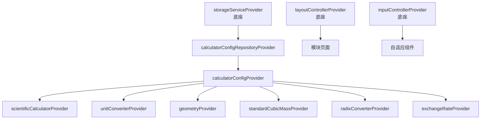

# 多功能计算器模块 — 设计规范

> **文档类型**: 子项目设计规范（含 ADR）
> **模块 ID**: `calculator`
> **约束基线**: `design.md` + `project_constraints.md` + `modular_tool_app_spec.md`
> **版本**: v1.0
> **状态**: 已复核（与主线约束一致）

---

## 1. 设计概览

### 1.1 设计目标

多功能计算器模块在 AMEToolbox 主项目（APP 底座）约束下，以**子项目**形式独立开发。
模块需同时满足工厂现场的复杂计算需求与底座统一的 UI/UX、状态管理、平台抽象、输入适配、数据同步要求。

### 1.2 引用的主线 ADR

本模块的所有设计决策均基于主线 `design.md` 已采纳的架构决策记录（ADR），未引入与主线冲突的新决策：

| 主线 ADR | 标题 | 对本模块的影响 |
|----------|------|----------------|
| ADR-003 | 选择 Riverpod 作为状态管理 | 模块所有页面使用 `ConsumerWidget`，状态通过 `ref.watch/read` 访问；模块内部 Provider 在 `providers/` 中声明 |
| ADR-006 | 主项目 + 子项目分层架构 | 模块代码位于 `modules/calculator/`，通过 `ModuleContract` 接入；不访问底座私有实现 |
| ADR-007 | 宽高比断点策略 | 模块布局使用底座 `ResponsiveBuilder` / `LayoutMode`，不自行计算横竖屏 |
| ADR-008 | 触控 + 键鼠双输入模式 | 模块优先复用底座 `AdaptiveButton`、`AdaptiveListTile`；自定义键盘按钮根据 `InputMode` 调整尺寸与反馈 |
| ADR-004 | 选择 Hive 作为本地存储 | 模块通过 `StorageService` 抽象读写数据，key 前缀 `module_calculator_` |
| ADR-005 | 选择 WebDAV 作为数据同步 | 模块实现 `exportData` / `importData`，数据按设备维度同步 |
| ADR-012 | 设置页三大分区 + 总开关 | 模块专属设置页遵循 MD3 分组列表规范，复杂设置项进入子页面 |

### 1.3 模块专属 ADR

以下决策仅影响本模块内部实现，已通过 ARCH 角色确认：

#### ADR-CAL-001：复用 `math_expressions` 进行科学表达式解析

- **状态**: 已采纳
- **背景**: 科学计算器需要支持表达式求值、函数、括号、运算符优先级等，自研解析器容易出错。
- **决策**: 引入开源包 `math_expressions`（MIT），并在其上层封装 `ScientificCalculatorService`，负责符号规范化（`×`→`*`、`÷`→`/`）、角度模式转换、错误处理与结果格式化。
- **后果**: 降低表达式解析错误率；封装层保证后续可替换底层包而不影响 UI。

#### ADR-CAL-002：复用 `units_converter` 进行线性单位换算

- **状态**: 已采纳
- **背景**: 长度、重量、面积、体积、速度、时间、角度等单位换算属于成熟问题域。
- **决策**: 引入开源包 `units_converter`（MIT）处理线性单位换算；温度等非线性换算自研公式覆盖。
- **后果**: 减少重复开发；温度等特殊情况通过自研保证精度。

#### ADR-CAL-003：标准立方米 ↔ 质量基于摩尔质量计算

- **状态**: 已采纳
- **背景**: 标准立方米（Nm³）是气体流量计常用单位，换算为质量需考虑气体种类与标准状态。
- **决策**: 采用 `质量(kg) = 标准体积(Nm³) × 摩尔质量(g/mol) ÷ 标准摩尔体积(L/mol)`，默认 `Vm = 22.414 L/mol`（0°C、101.325 kPa），支持自定义。
- **后果**: 与工程热力学一致；支持常见工业气体及混合气自定义。

#### ADR-CAL-004：所有计算器统一保存历史记录

- **状态**: 已采纳（已修订）
- **背景**: 各计算器的输入参数、单位、结果均可能需要回溯或回填；统一的历史入口可降低用户认知成本。
- **决策**: 所有 6 类计算器均保存最近 20 条历史；`CalculationHistory` 通过 `metadata` 字段存储各计算器特有的输入参数，支持精确回填。
- **后果**: 历史记录统一服务于全部计算场景；模块首页历史入口对所有计算器类型可见。

#### ADR-CAL-005：完整键盘采用 4 列竖版 MD3 按钮布局

- **状态**: 已采纳（已修订）
- **背景**: 模块以竖屏为主要使用场景，传统横版科学键盘在窄屏下拥挤；同时必须满足主线 MD3 组件规范，不得自定义视觉样式。
- **决策**: 完整键盘采用 **4 列竖版布局**，所有按键均基于 Material Design 3 按钮组件实现：
  - 数字键（`0-9`、`.`、`Ans`）使用 `FilledButton.tonal`；
  - 编辑键（`C`、`⌫`）与等号（`=`）使用 `FilledButton`；
  - 算符与函数键使用 `OutlinedButton` 或 `TextButton`；
  - 上方高级算符/函数区域按功能分区排列；
  - `2nd` 键切换第二功能面板。
- **后果**: 竖屏可用性提升；4 列布局在窄屏下按键宽度更均匀；数字区位于左下角，符合右手持机时拇指自然落点；基础算符的包围结构便于单手快速切换运算符与结果确认；视觉严格遵循 MD3。

#### ADR-CAL-006：子项目通过 `path` 依赖复用底座契约

- **状态**: 已采纳
- **背景**: 模块需独立开发、独立测试，但又必须依赖底座 `ModuleContract`、`StorageService`、Provider 等。
- **决策**: 子项目 `pubspec.yaml` 使用 `ametoolbox: path: ../../` 依赖主项目；模块内部引用底座包使用 `package:ametoolbox/...`。
- **后果**: 实现严格隔离；合并到主项目时无需修改模块内部 import。

#### ADR-CAL-007：非科学计算器统一使用 MD3 数字小键盘

- **状态**: 已采纳
- **背景**: 单位换算、几何、标准立方米-质量等计算器原本仅依赖系统键盘，在 Windows 等桌面场景下输入体验不一致；同时需与主线 MD3 规范保持一致。
- **决策**: 为单位换算、几何、标准立方米-质量等非科学计算器统一提供模块内 `NumericKeypad`，按键同样基于 MD3 按钮组件（`FilledButton.tonal`、`FilledButton`、`OutlinedButton`）实现；输入框保持可聚焦并支持物理键盘输入，实现应用内键盘与物理键盘双输入。
- **后果**: 各计算器输入体验统一；数字小键盘可作为模块内共享组件复用；满足触控与键鼠双模式要求。

---

## 2. 状态管理设计

### 2.1 Provider 清单

| Provider | 类型 | 职责 |
|----------|------|------|
| `calculatorConfigRepositoryProvider` | `Provider<CalculatorConfigRepository>` | 注入 Repository |
| `calculatorConfigProvider` | `ChangeNotifierProvider<CalculatorConfigController>` | 模块配置状态（当前计算器、精度、布局、键盘、设置等） |
| `scientificCalculatorProvider` | `ChangeNotifierProvider<ScientificCalculatorController>` | 科学计算器表达式、结果、历史、角度模式 |
| `unitConverterProvider` | `ChangeNotifierProvider<UnitConverterController>` | 单位转换器当前类别、输入、输出单位 |
| `geometryProvider` | `ChangeNotifierProvider<GeometryController>` | 几何体选择、输入参数、计算结果 |
| `standardCubicMassProvider` | `ChangeNotifierProvider<StandardCubicMassController>` | 气体类型、摩尔质量、体积/质量 |
| `radixConverterProvider` | `ChangeNotifierProvider<RadixConverterController>` | 进制输入、位运算、位宽 |
| `exchangeRateProvider` | `ChangeNotifierProvider<ExchangeRateController>` | 汇率缓存、货币选择、刷新状态 |

### 2.2 状态更新原则

- **配置类状态**（`CalculatorConfig`）使用 `ChangeNotifierController`，多属性联动并即时持久化。
- **页面级简单状态**（如当前选中的单位类别）使用 `StateProvider`。
- 所有 Controller 通过 Repository 读写 `StorageService`，不直接访问 Hive。
- 状态变化后通过 `notifyListeners()` 触发 UI 重建；Widget 使用 `ref.watch` 监听。

### 2.3 Provider 依赖图



---

## 3. 数据设计

### 3.1 数据模型

| 模型 | 职责 | 持久化 |
|------|------|--------|
| `CalculatorConfig` | 模块级配置（当前计算器、精度、布局、键盘、设置等） | 是 |
| `CalculationHistory` | 所有计算器单条历史记录 | 是 |
| `ExchangeRateCache` | 汇率缓存 | 是 |

### 3.2 持久化策略

- 通过 `StorageService.saveData/loadData` 读写，key 前缀 `module_calculator_`。
- 配置变更后即时写入，避免数据丢失。
- 敏感数据：模块不存储密码等敏感信息；设备 ID 由底座管理。

### 3.3 同步数据格式

```dart
{
  'module_calculator_config': <CalculatorConfig json>,
  'module_calculator_history': <List<CalculationHistory> json>,
  'module_calculator_exchange_rates': <ExchangeRateCache json>,
}
```

---

## 4. UI/UX 设计

### 4.1 布局设计

| 布局模式 | 结构 | 说明 |
|----------|------|------|
| 竖屏（Portrait） | 单列：顶部控制区 → 结果区 → 计算器主体 → 键盘 | 历史入口在 AppBar 右侧 |
| 横屏（Landscape） | 双列：左/右计算器，另一侧固定历史面板 | 位置由 `historyPanelOnLeft` 控制 |

- 使用底座 `ResponsiveBuilder` 监听 `LayoutMode`。
- 布局切换动画时长 300ms，使用 `Curves.easeInOut`。

### 4.2 输入模式适配

- 模块内所有按钮优先使用底座 `AdaptiveButton`；不满足场景时自定义按钮内部读取 `InputMode`。
- 触控模式：按钮最小点击区域 48×48dp，键盘按键之间加大间距。
- 键鼠模式：支持 hover 高亮、键盘快捷键（如 `Enter` 计算、`Esc` 清空、`Backspace` 退格）。

### 4.3 MD3 视觉令牌与组件规范

本模块视觉严格遵循主线 `design.md` §4.1 的 Material Design 3 落地要求：

#### 4.3.1 色彩系统

- 所有颜色必须从 `Theme.of(context).colorScheme` 获取，禁止硬编码。
- 错误结果使用 `colorScheme.error`。
- 强调容器使用 `primaryContainer` / `secondaryContainer` / `tertiaryContainer` 等 MD3 容器色，禁止通过 `withOpacity` / `withValues(alpha: ...)` 自行调制半透明背景。

#### 4.3.2 形状系统

- 遵循 MD3 圆角规范：
  - 小圆角（按钮、输入框、小卡片）：4dp；
  - 中圆角（卡片、中等尺寸组件）：12dp；
  - 大圆角（对话框、大表面）：16dp。
- 禁止在文档或代码中使用未经验证的自定义圆角值。

#### 4.3.3 排版系统

- 使用 `Theme.of(context).textTheme` 中的 MD3 文本样式：
  - 页面标题：`titleLarge`
  - 区块标题：`titleMedium`
  - 正文/标签：`bodyMedium` / `bodySmall` / `labelLarge`
  - 结果数值：`titleMedium`（字重 `w500`）
- 结果区字体大小自适应，最大 56sp，最小 24sp，但仍需从 MD3 display 尺寸派生。

#### 4.3.4 组件清单

优先使用 Flutter 内置 MD3 组件，禁止自定义 `Material` + `InkWell` 等手法模拟按钮或卡片：

| 场景 | 推荐组件 |
|------|----------|
| 主要操作 | `FilledButton` |
| 次要/ tonal 操作 | `FilledButton.tonal` |
| 低权重操作 | `TextButton` |
| 带边框选项 | `OutlinedButton` |
| 工具栏图标 | `IconButton`（或底座 `AdaptiveIconButton`） |
| 列表项 | `ListTile`（或底座 `AdaptiveListTile`） |
| 卡片容器 | `Card` |
| 标签/筛选 | `Chip` / `InputChip` |
| 选择器 | `DropdownMenu`、`SegmentedButton` |
| 输入框 | `TextField` + `InputDecoration`（Outlined 或 Filled） |
| 菜单 | `PopupMenuButton` / `showMenu` |

#### 4.3.5 动效规范

- 状态切换、布局切换、按钮按压反馈、焦点变化等动画时长统一为 **300ms**，缓动曲线 `Curves.easeInOut`。
- 键盘按键按压使用 `InkWell` 默认涟漪反馈，不得自定义非 MD3 动效。

---

## 5. 业务逻辑分层

### 5.1 分层职责

| 层级 | 目录 | 职责 |
|------|------|------|
| 入口 | `calculator_module.dart` | 实现 `ModuleContract`，对接底座生命周期 |
| 页面 | `pages/` | 页面级 Widget，纯 UI 与状态消费 |
| 控制器 | `providers/` | Riverpod Controller，状态变更与业务编排 |
| 服务 | `services/` | 纯业务计算（表达式、单位、几何、进制、汇率等） |
| 数据 | `data/` | Repository，封装 `StorageService` |
| 模型 | `models/` | 数据模型与 JSON 序列化 |
| 组件 | `widgets/` | 模块私有可复用组件 |

### 5.2 数据流

```text
用户交互 → Widget → Controller → Service / Repository → StorageService
                ↓
           Controller notifyListeners → Widget rebuild
```

---

## 6. 安全与隐私

- 模块不存储 WebDAV 密码、设备 ID 等敏感数据，全部交给底座。
- 汇率 API 请求仅访问用户配置的公开源或自定义源，不引入第三方追踪。
- 模块数据同步走底座 WebDAV，遵循设备维度隔离。

---

## 7. 文件命名与目录规范

遵循 `design.md` 第 6.1 节命名规范：

| 类型 | 命名规则 | 示例 |
|------|----------|------|
| 模型 | `<name>.dart` | `calculator_config.dart` |
| Provider | `<name>_provider.dart` | `calculator_config_provider.dart` |
| Controller | `<name>_controller.dart` | `scientific_calculator_controller.dart` |
| 服务 | `<name>_service.dart` | `scientific_calculator_service.dart` |
| 页面 | `<name>_page.dart` | `calculator_home_page.dart` |
| Widget | `<name>_widget.dart` 或 `<name>.dart` | `scientific_keypad.dart` |
| Repository | `<name>_repository.dart` | `calculator_config_repository.dart` |

---

## 8. 外部依赖与开源代码

| 来源 | 用途 | 许可 | 集成方式 |
|------|------|------|----------|
| `math_expressions` | 科学表达式解析与求值 | MIT | pub 依赖，封装为 `ScientificCalculatorService` |
| `units_converter` | 线性单位换算 | MIT | pub 依赖，封装为 `UnitConverterService` |
| `intl` | 数字格式化 | BSD-3 | pub 依赖 |
| `dio` | 汇率 HTTP 请求 | MIT | 复用底座依赖 |
| 自研 | 几何公式、温度换算、标准立方米-质量、进制转换、汇率业务逻辑、UI | - | 模块内部实现 |

---

## 9. 测试策略

| 测试层级 | 覆盖目标 | 工具 |
|----------|----------|------|
| 单元测试 | Services、Models、Repository | `flutter_test` |
| Widget 测试 | Pages、Keypad、Cards、Layout | `flutter_test` |
| 集成测试 | 模块注册、设置、同步导入导出 | 手动 + 底座集成 |
| 静态分析 | 全模块 | `flutter analyze` |

---

## 10. 风险与应对

| 风险 | 影响 | 应对 |
|------|------|------|
| `math_expressions` 不支持中文符号或特定函数 | 中 | 封装层做符号规范化与错误兜底 |
| `units_converter` 温度等非线性换算精度不足 | 低 | 温度完全自研，不依赖包的线性换算 |
| 汇率 API 不可用或限流 | 中 | 支持自定义源 + 离线缓存 |
| 横竖屏切换导致键盘/历史状态异常 | 中 | 状态由 Riverpod 管理，布局只影响视觉 |

---

## 11. 复核记录

| 日期 | 复核内容 | 复核结论 | 修正项 |
|------|----------|----------|--------|
| 2026-07-31 | 与 `project_constraints.md` / `design.md` / `task_assignments.md` 主线约束对齐 | 通过 | `unitConverterProvider` 统一为 `ChangeNotifierProvider`，与模块其他 Controller 保持一致 |
| 2026-07-31 | 完整键盘布局需求调整 | 通过 | ADR-CAL-005 与 `calculator_spec.md` §3.1.5 更新为 4 列竖版布局：数字区位于左下角，基础算符围绕数字区上方一行及右侧一列，高级算符在上方 |

## 12. 参考文档

- [design.md](../../../../design.md)
- [project_constraints.md](../../../../project_constraints.md)
- [modular_tool_app_spec.md](../../../../modular_tool_app_spec.md)
- [guide.md](../../../../guide.md)
- [task_assignments.md](../../../../task_assignments.md)
- [calculator_spec.md](./calculator_spec.md)
- [calculator_plan.md](./calculator_plan.md)
