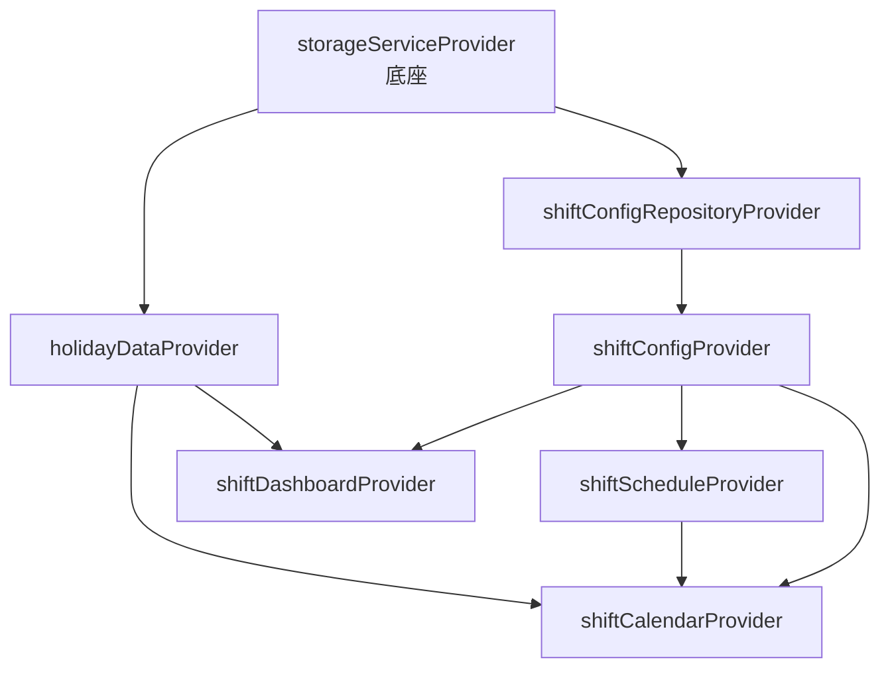

# 倒班助手模块 — 设计规范

> **文档类型**: 子项目设计规范（含 ADR）
> **模块 ID**: `shift_assistant`
> **约束基线**: `design.md` + `project_constraints.md` + `modular_tool_app_spec.md`
> **版本**: v2.0
> **状态**: 已定稿

---

## 1. 设计概览

### 1.1 设计目标

倒班助手模块面向工厂多班组轮班场景，提供：

- 多班组倒班序列管理（3–6 个班的常见轮班形式）。
- 以月历为核心的日历视图，按周分组展示整月排班，支持横向滚动适配窄宽度。
- 国家法定节假日、调休、农历日期展示，调休数据通过多公开源在线更新。
- 历史与未来日期快速查询及跳转。
- 首页仪表盘聚焦当天排班，主要班组优先高亮。

模块继续以子项目形式独立开发，成熟功能优先借用开源代码，自研部分聚焦业务编排与 UI 集成。

### 1.2 引用的主线 ADR

| 主线 ADR | 标题 | 对本模块的影响 |
|----------|------|----------------|
| ADR-003 | 选择 Riverpod 作为状态管理 | 模块所有页面使用 `ConsumerWidget`；状态通过 `ref.watch/read` 访问；Provider 在 `providers/` 中声明 |
| ADR-006 | 主项目 + 子项目分层架构 | 模块代码位于 `modules/shift_assistant/`，通过 `ModuleContract` 接入；不访问底座私有实现 |
| ADR-007 | 宽高比断点策略 | 日历视图使用底座 `ResponsiveBuilder` / `LayoutMode` 切换横竖屏布局 |
| ADR-008 | 触控 + 键鼠双输入模式 | 模块优先复用底座 `AdaptiveButton`、`AdaptiveListTile`；拖拽排序根据 `InputMode` 调整反馈 |
| ADR-004 | 选择 Hive 作为本地存储 | 模块通过 `StorageService` 抽象读写数据，key 前缀 `module_shift_assistant_` |
| ADR-005 | 选择 WebDAV 作为数据同步 | 模块实现 `exportData` / `importData`，数据按设备维度同步 |
| ADR-012 | 设置页三大分区 + 总开关 | 模块专属设置页遵循 MD3 分组列表规范 |

### 1.3 模块专属 ADR

#### ADR-SHF-001：多班组 × 轮班模式分离模型

- **状态**: 已采纳
- **背景**: 一个工厂用户可能同时关心多个班组（如本班组、相邻班组、管理班组），每个班组可以采用不同的轮班周期；班组顺序需要可调整。
- **决策**: 数据模型拆分为 `ShiftGroup`（班组，含显示顺序、是否主要班组）与 `ShiftPattern`（轮班模式，含周期与班次定义）。班组引用模式，便于 3–6 班制模板复用。
- **后果**: 模型更灵活；班组顺序与主要班组状态持久化；轮班模式模板可被多个班组共享。

#### ADR-SHF-002：以月历为核心的日历布局

- **状态**: 已采纳
- **背景**: 用户需要像日历 APP 一样纵览整月所有班组的排班情况，而非只看一周或当天；截图显示的目标布局以“周”为子块、以“班次”为行、以“日期”为列。
- **决策**: 主视图采用“月历”：顶部年月标题与翻月控件 → 星期标题行 → 按周分组的日历块。每周块左侧为班次行标签，右侧 7 列为周一至周日，每个单元格显示日期及承担该班次的班组名称。当窗口宽度不足时，每周块整体横向滚动，避免文字被压扁。
- **后果**: 信息密度高，与目标截图一致；窄宽度通过横向滚动保证可读性；数据模型与渲染层解耦。

#### ADR-SHF-003：节假日数据“本地兜底 + 多源在线更新”

- **状态**: 已采纳
- **背景**: 国家节假日与调休每年由国务院发布，无法通过固定算法推导；但模块必须离线可用。
- **决策**:
  1. 内置近三年（当前年 ±1）节假日数据作为兜底。
  2. 通过三个公开源按优先级拉取更新：NateScarlet/holiday-cn、cg-zhou/holiday-calendar、Chinese Days。
  3. 每次模块启动（或 APP 回到前台）检查更新，失败则降级使用本地缓存/兜底数据。
- **后果**: 强网络无关性；数据新鲜度可控；需要处理多源格式归一化与异常降级。

#### ADR-SHF-004：借用开源 `lunar` 与自研月历网格

- **状态**: 已采纳
- **背景**: 农历/节气计算工作量大且易错，社区已有成熟实现；目标月历布局（周块 × 班次行 × 日期列）与通用日历组件的默认网格差异较大，自研更贴合截图架构。
- **决策**:
  - 农历、节气、干支采用 `lunar`（MIT），本地计算不依赖网络。
  - 月历网格自研：使用 `CustomScrollView` + `LayoutBuilder` 按周渲染，左侧班次标签、右侧 7 列日期，窄宽度时每周块横向滚动。
- **后果**: 农历计算复用成熟库；月历布局与截图严格一致，避免通用组件二次定制带来的耦合与样式偏移。

#### ADR-SHF-005：班组顺序可拖动，主要班组固定置顶

- **状态**: 已采纳
- **背景**: 用户希望按个人关注度调整班组显示顺序；主要班组（如用户所在班组）需要始终在最上方并视觉突出。
- **决策**: `ShiftGroup.displayOrder` 控制普通班组顺序；`ShiftGroup.isPrimary` 为 true 时该班组在渲染阶段被提到最前（不修改 displayOrder）。顺序通过 `ReorderableListView` / `ReorderableDragStartListener` 调整。
- **后果**: 主要班组逻辑与普通顺序解耦；UI 渲染层负责置顶，数据层只负责标志位。

---

## 2. 状态管理设计

### 2.1 Provider 清单

| Provider | 类型 | 职责 |
|----------|------|------|
| `shiftConfigRepositoryProvider` | `Provider<ShiftConfigRepository>` | 注入 Repository |
| `shiftConfigProvider` | `ChangeNotifierProvider<ShiftConfigController>` | 班组、轮班模式、主要班组、显示顺序 |
| `shiftCalendarProvider` | `ChangeNotifierProvider<ShiftCalendarController>` | 当前聚焦日期、当前周、选中日期 |
| `holidayDataProvider` | `ChangeNotifierProvider<HolidayDataController>` | 节假日/调休缓存、更新状态、多源拉取 |
| `shiftScheduleProvider` | `Provider<ShiftScheduleService>` | 日期 → 各班组班次计算（纯函数服务） |
| `shiftDashboardProvider` | `ChangeNotifierProvider<ShiftDashboardController>` | 首页仪表盘聚合数据 |

### 2.2 状态更新原则

- 配置类状态（班组、模式、顺序）使用 `ChangeNotifierController`，变更后即时持久化。
- 日历视图状态（聚焦日期、选中日期）与配置状态分离，避免切换周时触发配置持久化。
- 节假日数据为只读缓存，由 `HolidayDataController` 负责后台更新与版本管理。
- 所有 Controller 通过 Repository 读写 `StorageService`，不直接访问 Hive。

### 2.3 Provider 依赖图



---

## 3. 数据设计

### 3.1 数据模型

| 模型 | 职责 | 持久化 |
|------|------|--------|
| `ShiftConfig` | 模块级根配置：班组列表、轮班模式列表、主要班组 ID、节假日缓存、最后更新时间 | 是 |
| `ShiftGroup` | 单个班组：名称、颜色、引用的轮班模式 ID、基准日期、显示顺序、是否主要班组 | 嵌入 `ShiftConfig` |
| `ShiftPattern` | 轮班模式：名称、周期天数、班次列表 | 嵌入 `ShiftConfig` |
| `ShiftSlot` | 单个班次：名称、起止时间、是否休息 | 嵌入 `ShiftPattern` |
| `HolidayInfo` | 单天节假日信息：名称、是否法定假日、是否调休上班 | 嵌入 `ShiftConfig` |
| `DayInfo` | 某日期聚合信息：公历、农历、节气、节假日、各班组班次 | 不持久化，运行时聚合 |

### 3.2 持久化策略

- 通过 `StorageService.saveData/loadData` 读写，key 前缀 `module_shift_assistant_`。
- 配置变更后即时写入。
- 节假日缓存作为 `ShiftConfig` 的一部分持久化，避免每次启动都依赖网络。
- 敏感数据：模块不存储密码等敏感信息；设备 ID 由底座管理。

### 3.3 同步数据格式

```dart
{
  'module_shift_assistant_config': <ShiftConfig json>,
}
```

---

## 4. UI/UX 设计

### 4.1 布局设计

#### 首页仪表盘（Dashboard）

| 布局模式 | 结构 | 说明 |
|----------|------|------|
| 竖屏 | 单列：日期/农历/节假日头图 → 当天所有班组班次卡片（主要班组置顶高亮）→ 月历缩略 → 快捷入口 | 卡片垂直堆叠 |
| 横屏 | 双列：左侧当天详情与主要班组大卡片，右侧当月排班缩略 | 使用底座 `ResponsiveBuilder` |

#### 月历页面（Month Calendar）

| 区域 | 结构 | 说明 |
|------|------|------|
| 标题栏 | 年月标题居中、左右翻月图标按钮、“今天”文字按钮 | 极窄宽度时标题区横向滚动 |
| 星期行 | “周一 ~ 周日” 7 列 + 左侧班次标签占位 | 与下方每周块列宽对齐 |
| 周块 | 左侧班次标签列 + 右侧 7×N 日期网格 | 每个单元格显示日期及该班次对应的班组；主要班组高亮 |
| 交互 | 点击日期选中；翻月/“今天”切换月份 | 月份切换使用 300ms easeInOut 淡入淡出动画 |

- 普通班组标签使用 `colorScheme.surfaceContainerHighest` 背景。
- 主要班组标签以班组颜色为种子生成局部 `ColorScheme`，使用 `primaryContainer` / `onPrimaryContainer`。
- 选中日期使用 `colorScheme.primaryContainer` 背景；当天使用 `colorScheme.primary` 边框。
- 休息班次使用低对比度文字；节假日在日期单元格显示 `colorScheme.error` / `colorScheme.tertiary` 标记。
- 日期单元格圆角 12dp（MD3 中组件），班组标签圆角 4dp（MD3 小组件），颜色全部取自 `Theme.of(context).colorScheme`，不硬编码。

### 4.2 输入模式适配

- 列表项与按钮优先使用底座 `AdaptiveButton`、`AdaptiveListTile`。
- 触控模式：班组卡片最小点击区域 48×48，拖拽排序使用长按触发。
- 键鼠模式：支持悬停高亮，拖拽排序通过 drag handle 触发，支持方向键切换选中日期。

### 4.3 主题与色彩

- 颜色全部来自 `Theme.of(context).colorScheme`，不硬编码。
- 每个班组可配置颜色，未配置时使用 `ColorScheme` 次要色板循环分配。
- 节假日文字使用 `colorScheme.error` 或 `colorScheme.tertiary`。
- 当前日期高亮使用 `colorScheme.primaryContainer`。

---

## 5. 业务逻辑分层

### 5.1 分层职责

| 层级 | 目录 | 职责 |
|------|------|------|
| 入口 | `shift_assistant_module.dart` | 实现 `ModuleContract`，对接底座生命周期 |
| 页面 | `pages/` | 页面级 Widget，纯 UI 与状态消费 |
| 控制器 | `providers/` | Riverpod Controller，状态变更与业务编排 |
| 服务 | `services/` | 纯业务计算（排班推算、农历格式化、节假日多源拉取） |
| 数据 | `data/` | Repository，封装 `StorageService` |
| 模型 | `models/` | 数据模型与 JSON 序列化 |
| 组件 | `widgets/` | 模块私有可复用组件 |

### 5.2 关键服务

| 服务 | 职责 |
|------|------|
| `ShiftScheduleService` | 根据班组基准日期、周期、偏移天数计算某日班次 |
| `LunarInfoService` | 封装 `lunar` 包，提供公历 → 农历、节气、干支、生肖查询 |
| `HolidayDataService` | 内置节假日兜底、多源在线拉取、格式归一化、缓存合并 |

### 5.3 数据流

```text
用户交互 → Widget → Controller → Service / Repository → StorageService
                ↓
           Controller notifyListeners → Widget rebuild
```

---

## 6. 安全与隐私

- 模块不存储 WebDAV 密码、设备 ID 等敏感数据，全部交给底座。
- 节假日数据源仅访问公开静态 JSON，不携带用户标识。
- 模块数据同步走底座 WebDAV，遵循设备维度隔离。

---

## 7. 文件命名与目录规范

遵循 `design.md` 第 6.1 节命名规范：

| 类型 | 命名规则 | 示例 |
|------|----------|------|
| 模型 | `<name>.dart` | `shift_config.dart` |
| Provider | `<name>_provider.dart` | `shift_calendar_provider.dart` |
| Controller | `<name>_controller.dart` | `shift_config_controller.dart` |
| 服务 | `<name>_service.dart` | `shift_schedule_service.dart` |
| 页面 | `<name>_page.dart` | `shift_dashboard_page.dart` |
| Widget | `<name>_widget.dart` 或 `<name>.dart` | `month_calendar_widget.dart` |
| Repository | `<name>_repository.dart` | `shift_config_repository.dart` |

---

## 8. 外部依赖与开源代码

| 来源 | 用途 | 许可 | 集成方式 |
|------|------|------|----------|
| `lunar` | 农历、节气、干支、生肖、宜忌 | MIT | pub 依赖，封装为 `LunarInfoService` |
| `intl` | 日期格式化 | BSD-3 | pub 依赖 |
| `holiday-cn` (NateScarlet) | 中国节假日/调休在线数据 | MIT | HTTP 拉取静态 JSON，离线缓存 |
| `holiday-calendar` (cg-zhou) | 中国节假日/调休在线数据备用源 | MIT | HTTP 拉取静态 JSON，离线缓存 |
| `Chinese Days` | 中国节假日/调休在线数据备用源 | 公开数据 | HTTP 拉取静态 JSON，离线缓存 |
| 自研 | 班组模型、排班推算、多源归一化、月历 UI、设置页 | - | 模块内部实现 |

---

## 9. 测试策略

| 测试层级 | 覆盖目标 | 工具 |
|----------|----------|------|
| 单元测试 | Services、Models、Repository、节假日多源归一化 | `flutter_test` |
| Widget 测试 | Dashboard、MonthCalendar、设置页、拖拽排序 | `flutter_test` |
| 集成测试 | 模块注册、数据同步导入导出、节假日更新降级 | 手动 + 底座集成 |
| 静态分析 | 全模块 | `flutter analyze` |

---

## 10. 风险与应对

| 风险 | 影响 | 应对 |
|------|------|------|
| 自研月历网格在极窄宽度下布局异常 | 中 | 使用 `LayoutBuilder` + `SingleChildScrollView`；班组名称 `FittedBox` 自适应；最小单元格宽度约束 |
| 节假日三源数据格式不一致 | 中 | `HolidayDataService` 统一归一化；任一源成功即可 |
| 跨夜班次日日期边界处理错误 | 高 | 服务层统一使用 DateTime 日期部分比较，班次时间独立存储为字符串 |
| 多班组大量数据导致月历性能下降 | 中 | 使用 `ValueKey` + `const` 构造函数；`AnimatedSwitcher` 仅在月份切换时触发重建 |
| 农历包 `lunar` 与月历网格解耦 | 低 | 月历组件只负责公历网格，农历/节假日由自研 Builder 渲染 |

---

## 11. 复核记录

| 日期 | 复核内容 | 复核结论 | 修正项 |
|------|----------|----------|--------|
| 2026-08-02 | 按新需求重构：多班组、周历、节假日、农历 | 草案 | 引入 `table_calendar`、`lunar`；模型拆分为 Group/Pattern/Slot |
| 2026-08-02 | 完成 v2.0 文档配套：spec / plan / todo；更新 ShiftConfig 模型与单元测试 | 已定稿 | 新增 `HolidayInfo`；页面改用 `AdaptiveListTile` |
| 2026-08-02 | 按截图调整为月历架构；严格对齐 MD3 规范 | 已定稿 | 删除 `table_calendar` 依赖；自研 `MonthCalendarView`；圆角、颜色、动画符合 MD3；删除 `week_calendar_view.dart` |

## 12. 参考文档

- [design.md](../../../../design.md)
- [project_constraints.md](../../../../project_constraints.md)
- [modular_tool_app_spec.md](../../../../modular_tool_app_spec.md)
- [guide.md](../../../../guide.md)
- [shift_assistant_spec.md](./shift_assistant_spec.md)
- [shift_assistant_plan.md](./shift_assistant_plan.md)
