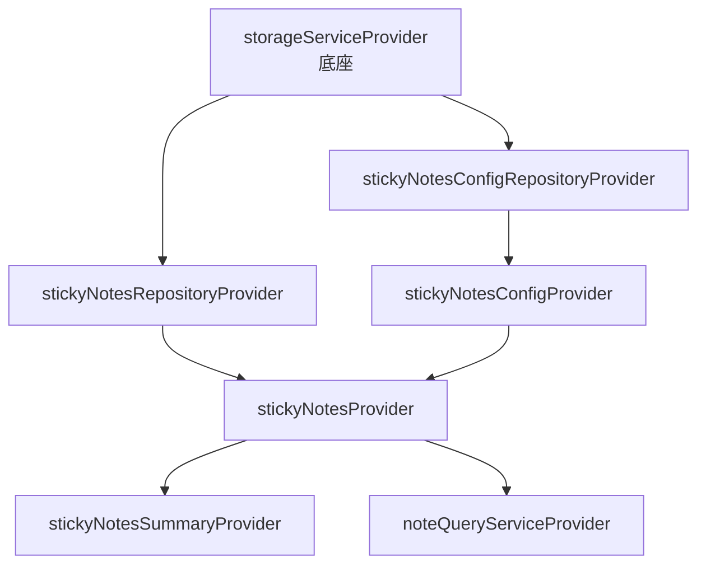

# 便签模块 — 设计规范

> **文档类型**: 子项目设计规范（含 ADR）
> **模块 ID**: `sticky_notes`
> **约束基线**: `design.md` + `project_constraints.md` + `modular_tool_app_spec.md`
> **版本**: v1.0
> **状态**: 草案
> **需求基线**: `sticky_notes_spec.md` v1.0

---

## 1. 设计概览

### 1.1 设计目标

便签模块面向用户轻量记录与整理需求，提供：

- 便签管理：标题 + 富文本正文 + 图片附件；创建、查看、编辑、删除。
- 置顶：便签可置顶固定，置顶便签恒排在普通便签之前。
- 分类/标签：自定义分类，用于整理与筛选。
- 富文本正文：段落、标题、列表、待办清单、引用、行内粗体/斜体/删除线。
- 图片附件：正文内嵌多张图片（base64 内嵌存储）。
- 首页仪表盘摘要（P1，合并入主线后开发）。
- 数据同步：实现 `exportData` / `importData` 满足契约（P1）。

模块以子项目形式独立开发，全部业务逻辑自研，仅复用底座契约、Provider 与自适应组件，**不新增第三方依赖**。

### 1.2 引用的主线 ADR

| 主线 ADR | 标题 | 对本模块的影响 |
|----------|------|----------------|
| ADR-003 | 选择 Riverpod 作为状态管理 | 模块所有页面使用 `ConsumerWidget`；状态通过 `ref.watch/read` 访问 |
| ADR-006 | 主项目 + 子项目分层架构 | 模块代码位于 `modules/sticky_notes/`，通过 `ModuleContract` 接入 |
| ADR-007 | 宽高比断点策略 | 主页面与设置页使用底座 `ResponsiveBuilder` / `LayoutMode` 切换布局 |
| ADR-008 | 触控 + 键鼠双输入模式 | 复用底座 `AdaptiveButton`、`AdaptiveIconButton`、`AdaptiveListTile` |
| ADR-004 | 选择 Hive 作为本地存储 | 模块通过 `StorageService` 抽象读写，key 前缀 `module_sticky_notes_` |
| ADR-012 | 设置页三大分区 + 总开关 | 模块专属设置页遵循 MD3 分组列表规范 |

### 1.3 模块专属 ADR

#### ADR-SN-001：富文本用自研块模型而非第三方依赖

- **状态**: 已采纳
- **背景**: 富文本渲染若引入 `flutter_quill` / `flutter_markdown` 等第三方包，需新增依赖并经 OWNER 确认；且富文本需求较轻量（连续文本 + 行内加粗/斜体/下划线/删除线/字号/颜色 + 内联图片）。
- **决策**: 定义自研 `NoteBlock`（sealed class）+ `NoteInline` 块模型；行内样式以 `List<NoteInline>`（runs）为唯一真源，自研 `RichTextEditingController` 覆写 `buildTextSpan` 渲染，文本编辑与选区样式应用收敛为纯函数（`NoteInlineRuns`）；JSON 用 `type` discriminator 反序列化。
- **后果**: 无新增依赖、类型即文档；渲染能力受限于内置组件，复杂排版（表格等）不支持，作为已知取舍记录。列表编辑区由每块一个 `TextField` 承载文本、图片块独立渲染，实现图文上下混排。

#### ADR-SN-002：正文图片 base64 内嵌存储

- **状态**: 已采纳
- **背景**: 图片需随便签数据一并存储与同步、与正文混排，且不引入额外文件管理复杂性。
- **决策**: 图片以 base64 内嵌于 `NoteImageAttachment`，并作为 `ImageBlock` 内联在 `StickyNote.content` 中，随 `module_sticky_notes_notes` 一并持久化；旧版 `StickyNote.images` 在读取时迁移为正文末尾图片块。
- **后果**: 存储自包含、无需管理文件生命周期；代价是图片多/尺寸大时数据量增加，设计阶段限定单图大小与数量阈值。

#### ADR-SN-003：数据按“配置 + 业务列表”双 key 存储

- **状态**: 已采纳
- **背景**: 分类与排序配置是低频元数据；便签是高频业务数据，且需按模块整体同步。
- **决策**: `StickyNotesConfig`（含分类、排序）存于 `module_sticky_notes_config`；便签列表存于 `module_sticky_notes_notes`。`exportData` 导出两者，`importData` 按 id 合并。
- **后果**: 配置与业务数据分离；同步导入按 id 合并，避免重复导入产生重复项。

#### ADR-SN-005：正文取消块类型，改为「文本块 + 图片块」连续图文

- **状态**: 已采纳
- **背景**: 初版按块类型（段落/标题/无序/有序/待办/引用）组织正文，并为每块提供「添加段落 / 块格式 / 删除本块」等操作入口，交互层级过重，与「一个便签对应一段内容」的博客式录入诉求不符。
- **决策**: 移除全部块类型与块级操作入口，正文只由**文本块**与**图片块**按顺序组成（回车即换行）；行内字号改为绝对 pt（滑块 + 数值输入框，8 ~ 72），字体颜色改为常用色板（参考 Office 主题色板）中的自定义 ARGB；正文编辑区改为独立的填充 + 描边容器，与页面背景区分。旧块类型数据在读取时降级为文本块。
- **后果**: 交互与数据模型显著简化，正文即「一段图文」；代价是失去标题/列表/引用等结构化排版，且旧有序列表序号、待办勾选状态不再保留（仅保留文本）。字号与颜色不再严格受 `textTheme` / `colorScheme` 约束（未自定义时仍继承，主题切换仅对未自定义部分自适应）。

#### ADR-SN-004：置顶独立于排序方式

- **状态**: 已采纳
- **背景**: 置顶是用户强意图的固定动作，不应被排序方式覆盖。
- **决策**: 置顶便签恒排在普通便签之前；置顶内部按 `pinnedAt` 倒序，再按所选排序方式。
- **后果**: 排序逻辑清晰；置顶状态变更即时持久化并 `notifyListeners`。

---

## 2. 状态管理设计

### 2.1 Provider 清单

| Provider | 类型 | 职责 |
|----------|------|------|
| `stickyNotesConfigRepositoryProvider` | `Provider<StickyNotesConfigRepository>` | 注入配置 Repository |
| `stickyNotesRepositoryProvider` | `Provider<StickyNotesRepository>` | 注入便签 Repository |
| `stickyNotesConfigProvider` | `ChangeNotifierProvider<StickyNotesConfigController>` | 分类列表、默认排序方式 |
| `stickyNotesProvider` | `ChangeNotifierProvider<StickyNotesController>` | 便签列表、增删改、置顶切换、分类筛选、排序、导入 |
| `stickyNotesSummaryProvider` | `Provider<NoteSummary>` | 由便签列表派生的首页摘要 |
| `noteQueryServiceProvider` | `Provider<NoteQueryService>` | 置顶 + 排序 + 分类筛选（纯函数） |

### 2.2 状态更新原则

- 配置类状态（分类、排序）使用 `ChangeNotifierController`，变更后即时持久化。
- 便签列表状态使用 `ChangeNotifierController`，所有变更（增删改、置顶切换、导入）统一走 Controller 方法，变更后即时持久化。
- 摘要为派生状态（`Provider` + `ref.watch`），不单独持久化。
- 所有 Controller 通过 Repository 读写 `StorageService`，不直接访问 Hive。

### 2.3 Provider 依赖图



---

## 3. 数据设计

### 3.1 数据模型

| 模型 | 职责 | 持久化 |
|------|------|--------|
| `StickyNotesConfig` | 模块级根配置：分类列表、默认排序方式 | 是（`module_sticky_notes_config`） |
| `NoteCategory` | 单个分类：名称、颜色、显示顺序 | 嵌入 `StickyNotesConfig` |
| `StickyNote` | 单个便签：标题、图文正文、分类、置顶、时间 | 是（`module_sticky_notes_notes`） |
| `NoteBlock`(sealed) | 正文块：文本块 / 图片块 | 嵌入 `StickyNote.content` |
| `ImageBlock` | 图片块：内联图片载荷（图文混排） | 嵌入 `StickyNote.content` |
| `NoteInline` | 行内元素：文本 + 加粗/斜体/下划线/删除线/绝对字号/自定义颜色/链接 | 嵌入 `NoteBlock` |
| `NoteImageAttachment` | 图片载荷：base64 数据、创建时间 | 嵌入 `ImageBlock` |
| `NoteSummary` | 首页摘要聚合 | 不持久化，运行时派生 |

### 3.2 持久化策略

- 通过 `StorageService.saveData/loadData` 读写，key 前缀 `module_sticky_notes_`。
- `StickyNotesConfig`：`module_sticky_notes_config`。
- `StickyNote` 列表：`module_sticky_notes_notes`（JSON 数组，含 schema 版本字段便于迁移）。
- 配置/列表变更后即时写入。
- 敏感数据：模块不存储密码等敏感信息，全部交给底座。

### 3.3 同步数据格式

```dart
{
  'module_sticky_notes_config': <StickyNotesConfig json>,
  'module_sticky_notes_notes': <List<StickyNote> json>,
}
```

- 富文本块 JSON 使用 `type` discriminator 标识具体 `NoteBlock` 子类，保证跨版本反序列化。
- 导入合并策略：配置整体替换；便签按 `id` 合并（远端存在且本地存在 → 以 `updatedAt` 较新者为准；仅单侧存在 → 保留双方）。

---

## 4. UI/UX 设计

### 4.1 布局设计

#### 首页仪表盘（Dashboard，P1）

| 布局模式 | 结构 | 说明 |
|----------|------|------|
| 竖屏 | 摘要卡片单列：便签总数 + 快捷进入 | 使用底座 `ModuleSummary` 卡片 |
| 横屏 | 摘要卡片两列网格 | 使用底座 `ResponsiveBuilder` |

#### 便签主页面

| 区域 | 结构 | 说明 |
|------|------|------|
| 顶部栏 | 标题“便签” + 新增 `AdaptiveIconButton` | MD3 AppBar |
| 分类筛选条 | 横向滚动分类标签（全部 / 各分类） | 点击切换筛选 |
| 便签列表 | 竖屏单列列表；横屏两列网格 | 置顶置前 + 排序方式 |

- 置顶便签：前置 `Icons.push_pin` 标识，颜色 `colorScheme.primary`。
- 空状态：无便签时展示 `Icons.sticky_note_2_outlined` + “暂无便签”（`bodyLarge`，`onSurfaceVariant`）。
- 列表项过渡动画使用 300ms `Curves.easeInOut`。

#### 详情/编辑页

- 标题（必填）、富文本编辑区（工具栏 + 块编辑）、图片附件（添加/删除/预览）、分类选择、置顶开关。
- 保存 `FilledButton`；取消/返回 `TextButton`；空标题拦截。

#### 设置页

- 分类管理（增删改/排序）、默认排序方式选择。

### 4.2 输入模式适配

- 列表项与按钮使用底座 `AdaptiveButton`、`AdaptiveIconButton`、`AdaptiveListTile`。
- 触控模式：操作最小点击区域 48×48dp。
- 键鼠模式：支持 hover 高亮；长按/右键弹出上下文菜单（编辑、删除、置顶/取消置顶）。

### 4.3 主题与色彩

- 颜色全部来自 `Theme.of(context).colorScheme`，不硬编码。
- 置顶标识使用 `colorScheme.primary`。
- 分类颜色：自定义分类使用 `ColorScheme` 次要色板循环分配。
- 删除分类后便签显示“无分类”（`onSurfaceVariant`）。
- 圆角遵循 MD3：小 4dp（标签/圆点）、中 12dp（卡片）、大 16dp（对话框容器）。
- 富文本标题字号取自 `textTheme`（`titleLarge` / `titleMedium` / `titleSmall`）。

---

## 5. 业务逻辑分层

### 5.1 分层职责

| 层级 | 目录 | 职责 |
|------|------|------|
| 入口 | `sticky_notes_module.dart` | 实现 `ModuleContract`，对接底座生命周期 |
| 页面 | `pages/` | 页面级 Widget，纯 UI 与状态消费 |
| 控制器 | `providers/` | Riverpod Controller，状态变更与业务编排 |
| 服务 | `services/` | 纯业务计算（排序/筛选/摘要、富文本解析渲染） |
| 数据 | `data/` | Repository，封装 `StorageService` |
| 模型 | `models/` | 数据模型与 JSON 序列化 |
| 组件 | `widgets/` | 模块私有可复用组件 |

### 5.2 关键服务

| 服务 | 职责 |
|------|------|
| `NoteQueryService` | 置顶 + 排序 + 分类筛选（纯函数） |
| `NoteSummaryService` | 摘要聚合（总数/置顶数/分类数） |
| `NoteRichTextParser` | 富文本块模型 ↔ 文本/渲染分发（纯函数） |

### 5.3 数据流

```text
用户交互 → Widget → Controller → Service / Repository → StorageService
                ↓
           Controller notifyListeners → Widget rebuild
```

---

## 6. 安全与隐私

- 模块不存储 WebDAV 密码、设备 ID 等敏感数据，全部交给底座。
- 图片附件 base64 仅随模块数据存储与同步，不写入系统其他位置。
- 模块数据同步走底座 WebDAV，遵循 WebDAV 账号维度隔离。

---

## 7. 文件命名与目录规范

遵循 `design.md` 第 6.1 节命名规范：

| 类型 | 命名规则 | 示例 |
|------|----------|------|
| 模型 | `<name>.dart` | `sticky_note.dart`、`note_category.dart`、`note_block.dart` |
| 值对象 | `<name>.dart` | `note_inline.dart` |
| Provider | `<name>_provider.dart` | `sticky_notes_provider.dart` |
| Controller | `<name>_controller.dart` | `sticky_notes_controller.dart` |
| 服务 | `<name>_service.dart` / `<name>_parser.dart` | `note_query_service.dart`、`note_rich_text_parser.dart` |
| 页面 | `<name>_page.dart` | `sticky_notes_page.dart`、`note_edit_page.dart` |
| Widget | `<name>_widget.dart` 或 `<name>.dart` | `note_card_widget.dart`、`note_category_filter.dart` |
| Repository | `<name>_repository.dart` | `sticky_notes_repository.dart` |

模块目录结构：

```
modules/sticky_notes/
├── docs/
├── lib/
│   ├── main.dart                 #【临时】独立运行入口（合并后删除）
│   ├── debug/                    #【临时】调试支撑（合并后删除）
│   └── features/sticky_notes/    # 模块正式业务代码
│       ├── sticky_notes_module.dart
│       ├── data/       models/   providers/
│       ├── services/   pages/    widgets/
└── test/
└── windows/                      #【临时】独立运行壳（合并后删除）
```

---

## 8. 外部依赖与开源代码

| 来源 | 用途 | 许可 | 集成方式 |
|------|------|------|----------|
| 底座 `StorageService` | 数据持久化 | - | 通过 `initialize(storage)` 注入 |
| 底座 `ResponsiveBuilder` / `Adaptive*` | 布局与组件 | - | 模块内复用 |
| 自研 | 便签模型、富文本解析渲染、分类、排序、图片附件 | - | 模块内部实现 |

- **不新增第三方依赖**；富文本渲染、图片插入均用 Flutter 内置能力实现。

---

## 9. 测试策略

| 测试层级 | 覆盖目标 | 工具 |
|----------|----------|------|
| 单元测试 | Models（JSON 往返，含 `NoteBlock` sealed class 各子类）、`NoteQueryService`（置顶/排序/筛选）、`NoteSummaryService`（摘要）、`NoteRichTextParser`（解析/渲染分发）、Repository | `flutter_test` |
| Widget 测试 | 主页面（列表、分类筛选、空状态、置顶切换）、详情/编辑页、设置页 | `flutter_test` |
| 集成测试 | 模块注册、`exportData` / `importData` 往返与合并 | 手动 + 底座集成 |
| 静态分析 | 全模块 | `flutter analyze` |

---

## 10. 风险与应对

| 风险 | 影响 | 应对 |
|------|------|------|
| 自研富文本渲染能力有限（无表格等复杂排版） | 中 | 明确需求边界为轻量富文本；文档记录取舍 |
| 图片 base64 导致数据量与 JSON 体积增大 | 中 | 限定单图大小/数量，压缩存储；文档记录取舍 |
| 横屏两列网格 + 可变高度卡片实现复杂度 | 中 | 用 `ResponsiveBuilder` 分层；组件拆分，Widget 测试覆盖；必要时参照底座 Masonry 思路 |
| 同步导入重复项 | 中 | 导入按 id 合并、以 `updatedAt` 判定新旧；schema 版本字段预留迁移 |
| 大量便签导致列表重建开销 | 低 | 使用 `ValueKey` + `const` 构造；列表项局部重建 |

---

## 11. 复核记录

| 日期 | 复核内容 | 复核结论 | 修正项 |
|------|----------|----------|--------|
| 2026-08-14 | 创建 v1.0 spec / design / coding_standards | 草案 | 初始版本 |

---

## 12. 参考文档

- [design.md](../../../../design.md)
- [project_constraints.md](../../../../project_constraints.md)
- [modular_tool_app_spec.md](../../../../modular_tool_app_spec.md)
- [sticky_notes_spec.md](./sticky_notes_spec.md) v1.0
- [sticky_notes_plan.md](./sticky_notes_plan.md) v1.0
- [sticky_notes_coding_standards.md](./sticky_notes_coding_standards.md) v1.0