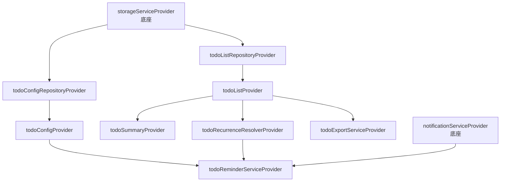

# 待办清单模块 — 设计规范

> **文档类型**: 子项目设计规范（含 ADR）
> **模块 ID**: `todo_list`
> **约束基线**: `design.md` + `project_constraints.md` + `modular_tool_app_spec.md`
> **版本**: v1.1
> **状态**: 已定稿（同步至 spec v1.2）
> **需求基线**: `todo_list_spec.md` v1.2

---

## 1. 设计概览

### 1.1 设计目标

待办清单模块面向工厂工人及管理者的日常任务管理场景，提供：

- 类日历主界面：页面上半为月视图日历，供快速选择日期；下半展示所选日期的待办列表。
- 待办项管理：名称（主要内容）+ 详情（文本 + 图片附件）；主页面仅显示名称，点击卡片进入详情查看/修改。
- 5 级优先级：最高、高、中、一般、日常，通过颜色标识区分，列表按顺序显示，支持“日常置顶”。
- 期限与循环：设定期限与循环类型；循环支持 14 种周期设定方式（五级菜单层级）、多规则共同生效、起止时间。
- 待办历史：一次性事项到期或完成后入历史，不再重启。
- 到期提醒：基于底座 `NotificationService`，在期限前 N 分钟推送系统通知。
- 首页仪表盘：首页展示未完成待办数量摘要。
- 数据导出：导出为 .md 文档或复制至剪贴板。
- 数据同步：通过 `exportData` / `importData` 参与底座 WebDAV 跨设备同步。

模块以子项目形式独立开发，全部业务逻辑自研，仅复用底座契约、Provider 与自适应组件。

### 1.2 引用的主线 ADR

| 主线 ADR | 标题 | 对本模块的影响 |
|----------|------|----------------|
| ADR-003 | 选择 Riverpod 作为状态管理 | 模块所有页面使用 `ConsumerWidget`；状态通过 `ref.watch/read` 访问；Provider 在 `providers/` 中声明 |
| ADR-006 | 主项目 + 子项目分层架构 | 模块代码位于 `modules/todo_list/`，通过 `ModuleContract` 接入；不访问底座私有实现 |
| ADR-007 | 宽高比断点策略 | 主页面与设置页使用底座 `ResponsiveBuilder` / `LayoutMode` 切换横竖屏布局 |
| ADR-008 | 触控 + 键鼠双输入模式 | 模块优先复用底座 `AdaptiveButton`、`AdaptiveIconButton`、`AdaptiveListTile`；交互按 `InputMode` 调整反馈 |
| ADR-004 | 选择 Hive 作为本地存储 | 模块通过 `StorageService` 抽象读写数据，key 前缀 `module_todo_list_` |
| ADR-005 | 选择 WebDAV 作为数据同步 | 模块实现 `exportData` / `importData`，数据按 WebDAV 账号维度同步 |
| ADR-012 | 设置页三大分区 + 总开关 | 模块专属设置页遵循 MD3 分组列表规范 |

### 1.3 模块专属 ADR

#### ADR-TDL-001：类日历 + 按日待办视图

- **状态**: 已采纳
- **背景**: 用户需要快速定位某一天的待办，直观看到日期与任务的关系。
- **决策**: 主页面采用“类日历月视图（上半）+ 所选日期待办列表（下半）”的布局；有待办的日期以标记提示；点击日期联动下方列表。循环事项的实例按命中日期归入对应天。
- **后果**: 交互直观；当日列表可持续由日历选中日期驱动；横屏时可并排增列。

#### ADR-TDL-002：循环规则用 sealed class + 专属计算引擎

- **状态**: 已采纳
- **背景**: 14 种循环周期方式差异大，若用 nullable 字段组合表达易歧义、难扩展。
- **决策**: `RecurrencePattern` 采用 sealed class/tagged union，14 个 `final class` 与截图五级菜单一一对应；`RecurrenceDateCalculator` 负责把规则转换为日期序列；`TodoRecurrenceResolver` 合并一个待办的多个规则。
- **后果**: 类型即文档、新增方式成本低；JSON 用 `type` discriminator，利于 WebDAV 同步与前后兼容。

#### ADR-TDL-003：一个待办多循环规则合并生效

- **状态**: 已采纳
- **背景**: 用户可能希望同一事项“每周一且每月 15 号”等组合。
- **决策**: `TodoItem.recurrenceRules` 为列表；每条规则独立计算命中日期后合并去重、升序排列；空列表表示一次性事项。
- **后果**: 支持组合循环；实例生成与提醒调度均基于合并后的日期序列。

#### ADR-TDL-004：提醒调度由模块编排、通知由底座执行

- **状态**: 已采纳
- **背景**: 平台通知实现复杂且跨平台差异大；底座已提供 `NotificationService` 抽象。
- **决策**: 模块内实现 `TodoReminderService`，负责计算提醒时间、维护“待办 → 通知 id”映射、在状态变更时重调度/取消；实际调度统一调用底座 `NotificationService.schedule/cancel`。
- **后果**: 模块不引入平台通知插件；提醒能力受底座通知服务实现约束（桌面端为 `local_notifier` + 应用内 Timer，应用退出后无法触发，作为已知限制记录）。

#### ADR-TDL-005：数据按“配置 + 业务列表”双 key 存储

- **状态**: 已采纳
- **背景**: 分类与提醒配置是低频变更的元数据；待办项是高频变更的业务数据，且 WebDAV 同步需要按模块整体导出。
- **决策**: `TodoConfig`（含分类列表、提醒开关、默认分钟数）存储于 `module_todo_list_config`；待办项列表整体存储于 `module_todo_list_items`。`exportData` 导出两者，`importData` 整体替换并做 id 去重合并。
- **后果**: 配置与业务数据分离；同步导入按 id 合并，避免重复导入产生重复项。

#### ADR-TDL-006：图片附件 base64 内嵌存储

- **状态**: 已采纳
- **背景**: 详情图片需随 WebDAV 同步，且不引入额外文件管理复杂性。
- **决策**: 图片以 base64 内嵌于 `TodoItem.images`，随 `module_todo_list_items` 一并存储与同步。
- **后果**: 同步自包含、无需管理文件生命周期；代价是数量多/尺寸大时数据量与 JSON 体积增加，作为已知取舍记录。

---

## 2. 状态管理设计

### 2.1 Provider 清单

| Provider | 类型 | 职责 |
|----------|------|------|
| `todoConfigRepositoryProvider` | `Provider<TodoConfigRepository>` | 注入配置 Repository |
| `todoListRepositoryProvider` | `Provider<TodoListRepository>` | 注入待办 Repository |
| `todoConfigProvider` | `ChangeNotifierProvider<TodoConfigController>` | 分类列表、提醒开关、默认提醒分钟数 |
| `todoListProvider` | `ChangeNotifierProvider<TodoListController>` | 待办项列表、完成切换、循环实例生成、增删改、导入 |
| `todoSummaryProvider` | `Provider<TodoListSummary>` | 由 `todoListProvider` 派生的首页摘要 |
| `todoRecurrenceResolverProvider` | `Provider<TodoRecurrenceResolver>` | 多规则合并日期解析 |
| `todoReminderServiceProvider` | `Provider<TodoReminderService>` | 提醒调度编排（依赖底座通知服务） |
| `todoExportServiceProvider` | `Provider<TodoExportService>` | .md 导出与剪贴板复制 |

### 2.2 状态更新原则

- 配置类状态（分类、提醒开关）使用 `ChangeNotifierController`，变更后即时持久化。
- 待办列表状态使用 `ChangeNotifierController`，所有变更（增删改、完成切换、循环实例生成、导入）统一走 Controller 方法，变更后即时持久化。
- 摘要为派生状态（`Provider` + `ref.watch(todoListProvider)`），不单独持久化。
- 所有 Controller 通过 Repository 读写 `StorageService`，不直接访问 Hive。
- 循环实例生成与提醒重调度在 Controller 内编排，委托 `TodoRecurrenceResolver` / `TodoReminderService`。

### 2.3 Provider 依赖图



---

## 3. 数据设计

### 3.1 数据模型

| 模型 | 职责 | 持久化 |
|------|------|--------|
| `TodoConfig` | 模块级根配置：分类列表、提醒开关、默认提醒分钟数 | 是（`module_todo_list_config`） |
| `TodoCategory` | 单个分类：名称、颜色、显示顺序 | 嵌入 `TodoConfig` |
| `TodoItem` | 单个待办项：名称、详情、图片、分类、优先级、期限、循环规则、完成/历史状态 | 是（`module_todo_list_items`） |
| `TodoImageAttachment` | 详情图片附件：base64 数据、创建时间 | 嵌入 `TodoItem.images` |
| `RecurrenceRule` | 循环规则：`RecurrencePattern` + 起止时间 | 嵌入 `TodoItem.recurrenceRules` |
| `RecurrencePattern`(sealed) | 14 种循环周期策略 | 嵌入 `RecurrenceRule` |
| `TodoListSummary` | 首页摘要聚合 | 不持久化，运行时派生 |

### 3.2 持久化策略

- 通过 `StorageService.saveData/loadData` 读写，key 前缀 `module_todo_list_`。
- `TodoConfig`：`module_todo_list_config`。
- `TodoItem` 列表：`module_todo_list_items`（JSON 数组，含 schema 版本字段便于迁移）。
- 配置/列表变更后即时写入。
- 敏感数据：模块不存储密码等敏感信息，全部交给底座。

### 3.3 同步数据格式

```dart
{
  'module_todo_list_config': <TodoConfig json>,
  'module_todo_list_items': <List<TodoItem> json>,
}
```

- 循环规则 JSON 使用 `type` discriminator 标识具体 `RecurrencePattern` 子类，保证跨版本反序列化。
- 导入合并策略：配置整体替换；待办项按 `id` 合并（远端存在且本地存在 → 以 `updatedAt` 较新者为准；仅单侧存在 → 保留双方）。

---

## 4. UI/UX 设计

### 4.1 布局设计

#### 首页仪表盘（Dashboard）

| 布局模式 | 结构 | 说明 |
|----------|------|------|
| 竖屏 | 摘要卡片单列：未完成数量 + 快捷进入 | 使用底座 `ModuleSummary` 卡片 |
| 横屏 | 摘要卡片两列网格 | 使用底座 `ResponsiveBuilder` |

#### 待办主页面（类日历 + 当日待办）

| 区域 | 结构 | 说明 |
|------|------|------|
| 顶部栏 | 标题“待办清单” + 新增 `AdaptiveIconButton` | MD3 AppBar |
| 上半 · 类日历 | 月视图日历：翻月、今天、选中、有待办日期标记 | 有待办日期用圆点/底色提示 |
| 下半 · 当日列表 | 所选日期的待办卡片，按优先级排序 | 卡片仅显示名称 + 优先级/期限辅助信息 |

- 点击日历日期 → 选中该日，下方列表联动。
- 待办卡片：前置完成勾选按钮；名称 + 辅助信息行（优先级色点/标 + 期限/循环标）；尾部编辑入口。
- 横屏：日历与列表并排或增列；竖屏：纵向堆叠。使用 `ResponsiveBuilder` 切换。
- 空状态：无待办时展示 `Icons.checklist_outlined` + “暂无待办”提示文字（`bodyLarge`，`onSurfaceVariant`）。
- 列表项过渡动画使用 300ms `Curves.easeInOut`。

#### 详情页 / 新增编辑表单

- 展示与编辑：名称、详情文本、图片附件、5 级优先级、期限、循环规则（多规则 + 五级菜单）、起止时间、提醒。
- 保存 `FilledButton`；取消/返回 `TextButton`；空名称拦截。

#### 设置页

- 分类管理、提醒设置（全局开关 + 默认提前分钟数）、导出（.md / 剪贴板）。

### 4.2 输入模式适配

- 列表项与按钮优先使用底座 `AdaptiveButton`、`AdaptiveIconButton`、`AdaptiveListTile`。
- 触控模式：完成勾选与编辑入口最小点击区域 48×48dp。
- 键鼠模式：支持 hover 高亮；长按/右键弹出上下文菜单（编辑、删除）。

### 4.3 主题与色彩

- 颜色全部来自 `Theme.of(context).colorScheme`，不硬编码。
- 5 级优先级颜色标识：最高 = `error`，高 = `errorContainer`，中 = `tertiary`，一般 = `onSurfaceVariant`，日常 = `secondary`。
- 已过期未完成项期限文字使用 `colorScheme.error`。
- 已完成项名称使用 `colorScheme.onSurfaceVariant` + 删除线。
- 日历选中日期使用 `primaryContainer` 背景；当天使用 `primary` 边框/填充。
- 分类颜色：自定义分类使用 `ColorScheme` 次要色板循环分配。
- 圆角遵循 MD3：小 4dp（标签/圆点）、中 12dp（卡片）、大 16dp（对话框容器）。

---

## 5. 业务逻辑分层

### 5.1 分层职责

| 层级 | 目录 | 职责 |
|------|------|------|
| 入口 | `todo_list_module.dart` | 实现 `ModuleContract`，对接底座生命周期 |
| 页面 | `pages/` | 页面级 Widget，纯 UI 与状态消费 |
| 控制器 | `providers/` | Riverpod Controller，状态变更与业务编排 |
| 服务 | `services/` | 纯业务计算（循环、查询/排序、摘要、提醒、导出） |
| 数据 | `data/` | Repository，封装 `StorageService` |
| 模型 | `models/` | 数据模型与 JSON 序列化 |
| 组件 | `widgets/` | 模块私有可复用组件 |

### 5.2 关键服务

| 服务 | 职责 |
|------|------|
| `RecurrenceDateCalculator` | 根据单一 `RecurrenceRule` 计算区间内命中日期（switch 分发 14 种，纯函数） |
| `TodoRecurrenceResolver` | 合并一个待办的多个规则命中日期，去重升序；空规则走一次性 dueDate |
| `TodoQueryService` | 优先级排序（+ 日常置顶）、过期判定、摘要聚合（纯函数） |
| `TodoReminderService` | 提醒时间计算、待办 → 通知 id 映射、重调度/取消编排（依赖底座通知服务） |
| `TodoExportService` | 生成 .md 文本、复制至剪贴板 |

### 5.3 数据流

```text
用户交互 → Widget → Controller → Service / Repository → StorageService
                ↓
           Controller notifyListeners → Widget rebuild
```

---

## 6. 安全与隐私

- 模块不存储 WebDAV 密码、设备 ID 等敏感数据，全部交给底座。
- 提醒通知内容仅包含待办标题，不包含其他业务数据。
- 模块数据同步走底座 WebDAV，遵循 WebDAV 账号维度隔离。
- 图片附件 base64 仅随模块数据存储与同步，不写入系统其他位置。

---

## 7. 文件命名与目录规范

遵循 `design.md` 第 6.1 节命名规范：

| 类型 | 命名规则 | 示例 |
|------|----------|------|
| 模型 | `<name>.dart` | `todo_item.dart`、`recurrence_rule.dart`、`recurrence_pattern.dart` |
| 值对象 | `<name>.dart` | `recurrence_value_objects.dart` |
| Provider | `<name>_provider.dart` | `todo_list_provider.dart` |
| Controller | `<name>_controller.dart` | `todo_list_controller.dart` |
| 服务 | `<name>_service.dart` | `todo_reminder_service.dart`、`recurrence_date_calculator.dart` |
| 页面 | `<name>_page.dart` | `todo_list_page.dart`、`todo_detail_page.dart` |
| Widget | `<name>_widget.dart` 或 `<name>.dart` | `todo_item_tile.dart`、`todo_month_calendar_view.dart` |
| Repository | `<name>_repository.dart` | `todo_list_repository.dart` |

模块目录结构：

```
modules/todo_list/
├── docs/
├── lib/
│   ├── main.dart                 #【临时】独立运行入口（合并后删除）
│   ├── debug/                    #【临时】调试支撑（合并后删除）
│   └── features/todo_list/       # 模块正式业务代码
│       ├── todo_list_module.dart
│       ├── data/       models/   providers/
│       ├── services/   pages/    widgets/
└── test/
└── windows/                      #【临时】独立运行壳（合并后删除）
```

---

## 8. 外部依赖与开源代码

| 来源 | 用途 | 许可 | 集成方式 |
|------|------|------|----------|
| `intl` | 日期格式化（中文） | BSD-3 | pub 依赖 |
| 底座 `NotificationService` | 到期提醒调度 | - | 通过底座 Provider 注入 |
| 底座 `StorageService` | 数据持久化 | - | 通过 `initialize(storage)` 注入 |
| 底座 `ResponsiveBuilder` / `Adaptive*` | 布局与组件 | - | 模块内复用 |
| 自研 | 待办模型、日历界面、循环计算、优先级排序、详情图片、导出 | - | 模块内部实现 |

- 剪贴板复制：优先复用底座能力；若底座未暴露，则模块内使用 Flutter 内置（不引入平台插件），超出底座接口时视为底座变更须 OWNER 确认。

---

## 9. 测试策略

| 测试层级 | 覆盖目标 | 工具 |
|----------|----------|------|
| 单元测试 | Models（JSON 往返，含 sealed class）、`RecurrenceDateCalculator`（14 种 + 边界）、`TodoRecurrenceResolver`（多规则合并）、`TodoQueryService`（排序/过期/摘要）、`TodoReminderService`（时间/映射/重调度）、`TodoExportService`（.md/剪贴板）、Repository | `flutter_test` |
| Widget 测试 | 主页面（类日历、当日列表、完成切换、空状态）、详情/表单、设置页 | `flutter_test` |
| 集成测试 | 模块注册、`exportData` / `importData` 往返与合并 | 手动 + 底座集成 |
| 静态分析 | 全模块 | `flutter analyze` |

---

## 10. 风险与应对

| 风险 | 影响 | 应对 |
|------|------|------|
| 桌面端通知在应用退出后无法触发（local_notifier Timer 实现限制） | 中 | 文档明示限制；提醒仅保证应用运行期间触发；后续评估原生调度 |
| 图片 base64 导致数据量与 JSON 体积增大 | 中 | 限单图大小/数量，压缩存储；文档记录取舍 |
| 14 种循环计算边界复杂易错 | 中 | 判定函数纯函数化，逐方式单测 + 边界用例 |
| 日历与列表交互、横屏布局复杂度 | 中 | 用 `ResponsiveBuilder` 分层；组件拆分，Widget 测试覆盖 |
| 同步导入重复项 | 中 | 导入按 id 合并、以 `updatedAt` 判定新旧；schema 版本字段预留迁移 |
| 大量待办导致列表重建开销 | 低 | 使用 `ValueKey` + `const` 构造；列表项局部重建 |

---

## 11. 复核记录

| 日期 | 复核内容 | 复核结论 | 修正项 |
|------|----------|----------|--------|
| 2026-08-11 | 创建 v1.0 spec / design / coding_standards | 草案 | 初始版本 |
| 2026-08-11 | 需求扩展（类日历、详情图片、5 级优先级、期限与循环 14 种、待办历史、导出、WebDAV） | 通过 | spec v1.1、design 待同步 |
| 2026-08-11 | 循环规则改为 sealed class + 计算引擎（五级菜单层级、多规则） | 通过 | spec v1.2 |
| 2026-08-11 | 将 design 同步至 spec v1.2（P0 前置） | 通过 | design v1.1 |

---

## 12. 参考文档

- [design.md](../../../../design.md)
- [project_constraints.md](../../../../project_constraints.md)
- [modular_tool_app_spec.md](../../../../modular_tool_app_spec.md)
- [todo_list_spec.md](./todo_list_spec.md) v1.2
- [todo_list_plan.md](./todo_list_plan.md) v1.1
- [todo_list_coding_standards.md](./todo_list_coding_standards.md) v1.0
- [todo_list_todo.md](./todo_list_todo.md)