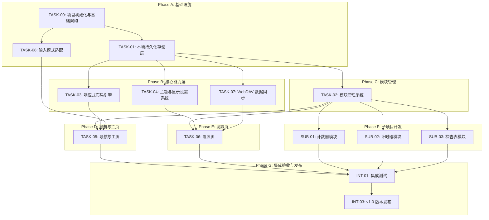

# AMEToolbox 开发任务分配文件

> **生成依据**: `modular_tool_app_spec.md` v0.7 + 项目立项报告 v1.0
> **生成日期**: 2026-07-28
> **用途**: Agent 可执行的开发任务分配
> **协作模式**: 个人项目 + AI Agent 协作（1人 + 4 Agent）

---

## 1. 任务概览表

### 1.1 APP 底座任务（TASK-00 ~ TASK-08）

| 任务ID | 任务名称 | 优先级 | 复杂度 | 预估工时 | 主导角色 | 依赖 |
|--------|---------|--------|--------|---------|---------|------|
| TASK-00 | 项目初始化与基础架构 | P0 | 低 | 3-5天 | DEV | 无 |
| TASK-01 | 本地持久化存储层 | P0 | 中 | 3-5天 | DEV | TASK-00 |
| TASK-02 | 模块管理系统 | P1 | 中 | 3-4天 | DEV | TASK-00, TASK-01 |
| TASK-03 | 响应式布局引擎 | P0 | 高 | 4-6天 | DEV | TASK-00, TASK-01 |
| TASK-04 | 主题与显示设置系统 | P1 | 高 | 4-6天 | DEV | TASK-00, TASK-01 |
| TASK-05 | 导航与主页 | P1 | 高 | 5-7天 | DEV | TASK-01, TASK-02, TASK-03, TASK-08 |
| TASK-06 | 设置页 | P2 | 中 | 4-5天 | DEV | TASK-01, TASK-02, TASK-04, TASK-07 |
| TASK-07 | WebDAV 数据同步 | P1 | 高 | 5-7天 | DEV | TASK-00, TASK-01 |
| TASK-08 | 输入模式适配（触控与键鼠） | P0 | 高 | 4-6天 | DEV | TASK-00 |

### 1.2 子项目任务（功能模块）

| 任务ID | 任务名称 | 优先级 | 复杂度 | 预估工时 | 主导角色 | 依赖 |
|--------|---------|--------|--------|---------|---------|------|
| SUB-01 | 计数器模块开发 | P1 | 中 | 2-3周 | DEV | TASK-02 (ModuleContract 冻结) |
| SUB-02 | 计时器模块开发 | P1 | 中 | 2-3周 | DEV | TASK-02 (ModuleContract 冻结) |
| SUB-03 | 检查表模块开发 | P1 | 中 | 2-3周 | DEV | TASK-02 (ModuleContract 冻结) |

### 1.3 集成与发布任务

| 任务ID | 任务名称 | 优先级 | 复杂度 | 预估工时 | 主导角色 | 依赖 |
|--------|---------|--------|--------|---------|---------|------|
| INT-01 | 集成测试 | P0 | 中 | 1-2周 | QA | 所有 TASK + SUB 完成 |
| INT-02 | CI/CD 流水线搭建 | P1 | 中 | 3-5天 | OPS | TASK-00 |
| INT-03 | v1.0 版本发布 | P0 | 低 | 2-3天 | OPS | INT-01, INT-02 |

---

## 2. 角色定义

| 角色 | 缩写 | 类型 | 职责 |
|------|------|------|------|
| 项目负责人 | OWNER | 人类 | 最终决策者。产品方向、需求确认、优先级排序、里程碑审批、代码最终审查与合并、验收签署 |
| 架构师Agent | ARCH | AI Agent | 技术架构师。技术方案设计、ModuleContract接口定义、技术约束检查、代码审查、设计评审 |
| 开发Agent | DEV | AI Agent | 全栈开发。APP底座开发 + 功能模块开发，编写单元测试，UI/UX 实现 |
| 质量保障Agent | QA | AI Agent | 质量保障。测试计划、集成测试、约束合规检查、Bug跟踪、测试报告 |
| 运维Agent | OPS | AI Agent | 开发运维。CI/CD、多平台构建、版本发布、产物管理 |

---

## 3. 详细任务卡片

### TASK-00: 项目初始化与基础架构

**基本信息**
| 属性 | 值 |
|------|-----|
| 优先级 | P0 |
| 复杂度 | 低 |
| 预估工时 | 3-5人天 |
| 主导角色 | DEV |
| 配合角色 | ARCH, OPS |
| 依赖 | 无 |

**概述**

初始化 Flutter 项目，配置 Windows 桌面端为首发平台，搭建 MD3 主题骨架、平台抽象层（含平台信息与系统设备信息抽象）、基础导航框架，为后续所有任务提供运行基础。UI 层从第一天起即与平台层解耦，确保后续移植到其他平台时无需修改 `lib/features/` 和 `lib/shared/` 下的任何代码。

**验收标准**
- [ ] `flutter create --platforms=windows` 生成的项目可成功编译运行（Windows 桌面端）
- [ ] `main.dart` 使用 `MaterialApp.router` 或 `MaterialApp` 配置 MD3 主题
- [ ] 应用启动后显示空白 Scaffold 页面，无崩溃
- [ ] 项目目录结构符合第 4 节定义的 `lib/` 布局，包含 `core/platform/` 和 `core/input/` 目录
- [ ] `pubspec.yaml` 中已添加基础依赖（flutter_riverpod, hive, hive_flutter, webdav_client, flutter_secure_storage, path_provider, device_info_plus, package_info_plus, window_manager）
- [ ] 已配置 `core/constants.dart`，包含预设强调色列表和默认配置值
- [ ] `PlatformInfo` 抽象接口已定义，UI 层通过此接口查询平台信息，不直接调用 `Platform.is*`
- [ ] `DeviceInfoProvider` 抽象接口已定义，UI 层通过此接口获取设备 ID、OS 版本、DPI 等信息
- [ ] Windows 平台的 `DeviceInfoProvider` 实现类已完成，可正确返回 deviceId、osName、osVersion、deviceModel、physicalDpi
- [ ] `deviceId` 获取逻辑：优先读取平台原生标识，失败时自生成 UUID 并持久化到 `flutter_secure_storage`
- [ ] 其他平台（macOS/Android/iOS/HarmonyOS）的 `DeviceInfoProvider` 实现类预留接口，Phase 2-4 开发时填充
- [ ] Windows 窗口最小尺寸已设置（建议 400x600），窗口可自由缩放
- [ ] 验证：在 `lib/features/` 和 `lib/shared/` 目录下搜索不到 `Platform.is` 或 `dart:io` 引用

**涉及文件**
- `pubspec.yaml`
- `lib/main.dart`
- `lib/app.dart`
- `lib/core/constants.dart`
- `lib/core/providers/platform_provider.dart`
- `lib/core/providers/storage_provider.dart`
- `lib/core/providers/theme_provider.dart`
- `lib/core/providers/layout_provider.dart`
- `lib/core/providers/input_provider.dart`
- `lib/core/providers/sync_provider.dart`
- `lib/core/platform/platform_info.dart`
- `lib/core/platform/platform_info_impl.dart`
- `lib/core/platform/device_info_provider.dart` (抽象接口)
- `lib/core/platform/windows_device_info.dart` (Windows 实现)
- `lib/core/platform/macos_device_info.dart` (预留)
- `lib/core/platform/android_device_info.dart` (预留)
- `lib/core/platform/ios_device_info.dart` (预留)
- `lib/core/platform/ohos_device_info.dart` (预留)
- `lib/core/input/input_controller.dart`
- `lib/core/input/input_mode_scope.dart`
- `windows/runner/` (Windows 平台配置)

**执行说明**
1. **DEV 主导工作**：
   - 执行 `flutter create --platforms=windows` 创建项目骨架
   - 编写 `pubspec.yaml` 依赖声明，添加所有基础依赖包
   - 实现 `lib/core/constants.dart` 预设常量
   - 实现 `PlatformInfo` 抽象接口及 `PlatformInfoImpl`
   - 实现 `DeviceInfoProvider` 抽象接口及 `WindowsDeviceInfoProvider`
   - 实现所有 Provider 声明文件（`platform_provider.dart`, `storage_provider.dart` 等）
   - 实现 `InputController` 基础骨架
   - 配置 Windows 窗口最小尺寸
   - 搭建 `lib/core/providers/` 下的 Riverpod Provider 架构

2. **ARCH 配合工作**：
   - 审查 `PlatformInfo` 和 `DeviceInfoProvider` 接口定义
   - 确认 `ModuleContract` 接口的初步设计（TASK-02 时冻结）
   - 指导 `WindowsDeviceInfoProvider` 中 DPI 获取的技术方案
   - 审查 `pubspec.yaml` 依赖选择的合理性

3. **OPS 配合工作**：
   - 确认 Windows 平台构建环境可用
   - 配置基础 CI 流水线（编译检查）

4. **关键设计决策点**（OWNER 审批 / ARCH 设计）：
   - `DeviceInfoProvider` 的条件导入方案（`export ... if (dart.library.io)`）
   - deviceId 的生成与持久化策略
   - Riverpod Provider 的依赖图结构
   - 窗口最小尺寸的合理性（400x600 是否满足最小功能需求）

5. **需要对齐的任务**：
   - TASK-01：存储层将依赖此任务定义的 Provider 架构
   - TASK-08：输入适配将依赖此任务定义的 `InputController`
   - 所有后续任务均依赖此任务

---

### TASK-01: 本地持久化存储层

**基本信息**
| 属性 | 值 |
|------|-----|
| 优先级 | P0 |
| 复杂度 | 中 |
| 预估工时 | 3-5人天 |
| 主导角色 | DEV |
| 配合角色 | ARCH |
| 依赖 | TASK-00 |

**概述**

实现本地持久化存储服务，提供统一的读写接口供所有配置和状态数据使用。包括模块状态、布局配置、主题配置、同步配置的增删改查。

**验收标准**
- [ ] `StorageService` 抽象接口定义完整，覆盖所有数据模型的 CRUD
- [ ] Hive 实现类 `HiveStorage` 可正确读写所有数据模型
- [ ] 预设模块清单在首次启动时自动初始化写入
- [ ] 应用重启后，上次保存的所有配置均可正确恢复
- [ ] 密码字段使用 `flutter_secure_storage` 加密存储，不以明文出现在 Hive 中
- [ ] 提供 `init()` 方法，在 `main()` 中调用完成初始化

**涉及文件**
- `lib/core/storage/storage_service.dart`
- `lib/core/storage/hive_storage.dart`
- `lib/core/models/module_definition.dart`
- `lib/core/models/module_state.dart`
- `lib/core/models/module_summary.dart`
- `lib/core/models/layout_config.dart`
- `lib/core/models/input_mode.dart`
- `lib/core/models/theme_config.dart`
- `lib/core/models/sync_config.dart`

**执行说明**
1. **DEV 主导工作**：
   - 定义 `StorageService` 抽象接口，包含所有数据模型的 CRUD 方法
   - 实现 `HiveStorage` 类，使用 Hive 进行本地持久化
   - 实现首次启动初始化逻辑：写入预设模块清单（3个模块）、默认 LayoutConfig、默认 ThemeConfig
   - 密码字段使用 `flutter_secure_storage` 加密存储
   - 在 `main.dart` 中调用 `StorageService.init()`

2. **ARCH 配合工作**：
   - 审查 `StorageService` 接口设计的完整性
   - 确认数据模型类的定义，确保与后续模块契约兼容
   - 指导加密存储方案

3. **关键设计决策点**（OWNER 审批 / ARCH 设计）：
   - Hive 类型适配器（TypeAdapter）的注册方式
   - 数据模型序列化方案（手动 toJson/fromJson 或代码生成）
   - 存储 key 命名空间约定（如 `module_<id>_*`）

4. **需要对齐的任务**：
   - TASK-02：依赖存储层读取模块状态
   - TASK-03：依赖存储层读取布局配置
   - TASK-04：依赖存储层读写主题配置
   - TASK-05：使用存储层获取已启用模块列表
   - TASK-06：读写同步配置和模块设置
   - TASK-07：读写同步配置、同步状态
   - 所有子项目：通过 `StorageService` 保存模块数据

---

### TASK-02: 模块管理系统

**基本信息**
| 属性 | 值 |
|------|-----|
| 优先级 | P1 |
| 复杂度 | 中 |
| 预估工时 | 3-4人天 |
| 主导角色 | DEV |
| 配合角色 | ARCH |
| 依赖 | TASK-00, TASK-01 |

**概述**

实现模块管理页面，用户可查看所有可用模块并通过开关启用/关闭各模块。开关状态持久化，变更即时影响导航栏和主页。**此任务完成后冻结 `ModuleContract` 接口**，子项目可开始需求编写。

**验收标准**
- [ ] 模块管理页面显示所有预设模块（图标 + 名称 + 描述 + Switch 开关）
- [ ] Switch 状态与 `ModuleState.enabled` 双向绑定
- [ ] 点击 Switch 即时切换状态，300ms 过渡动效，无需额外保存操作
- [ ] 页面底部显示"当前已启用 N 个模块"实时计数
- [ ] 开关状态写入本地存储，应用重启后保持
- [ ] 开关状态变更后，通过状态管理通知主页和导航栏更新
- [ ] 遵循 MD3 Switch 组件视觉规范
- [ ] `ModuleContract` 接口定义完成并在规格文档中冻结

**涉及文件**
- `lib/core/modules/module_contract.dart`
- `lib/core/modules/module_registry.dart`
- `lib/features/module_management/module_management_page.dart`
- `lib/shared/widgets/md3_switch.dart`

**执行说明**
1. **DEV 主导工作**：
   - 定义 `ModuleContract` 抽象接口（`definition`, `buildPage`, `summary`, `initialize`, `dispose`, `exportData`, `importData`）
   - 定义 `ModuleSummary` 数据类
   - 实现 `ModuleRegistry` 注册表
   - 开发模块管理页面 UI：MD3 风格列表 + Switch 开关
   - 实现开关状态双向绑定与持久化
   - 完成 UI/UX 设计落地（MD3 视觉规范、模块列表图标和布局）

2. **ARCH 配合工作**：
   - 审查并确认 `ModuleContract` 接口定义
   - 审查 `ModuleRegistry` 注册机制
   - 确认接口冻结后的变更控制流程

3. **关键设计决策点**（OWNER 审批 / ARCH 设计）：
   - `ModuleContract` 接口的完整性和扩展性（`exportData`/`importData` 的 Map 格式约定）
   - 模块摘要数据 `ModuleSummary` 的字段定义
   - 模块注册时机（`main()` 中 `StorageService.init()` 之后）

4. **需要对齐的任务**：
   - TASK-05：导航栏和主页依赖模块注册表获取模块列表
   - TASK-06：设置页的模块设置分区依赖模块注册表
   - SUB-01/02/03：子项目依赖冻结后的 `ModuleContract`

---

### TASK-03: 响应式布局引擎

**基本信息**
| 属性 | 值 |
|------|-----|
| 优先级 | P0 |
| 复杂度 | 高 |
| 预估工时 | 4-6人天 |
| 主导角色 | DEV |
| 配合角色 | ARCH |
| 依赖 | TASK-00, TASK-01 |

**概述**

实现响应式布局判定引擎：实时监听屏幕尺寸变化（包括设备旋转和桌面窗口缩放），根据宽高比与断点值判定横屏/竖屏模式，并暴露布局模式供所有页面消费。断点值支持自动检测和手动指定两种模式。同时实现 DPI 缩放机制，同样支持自动/手动两种模式。

**验收标准**
- [ ] `LayoutController` 监听 `MediaQuery` 尺寸变化，实时计算宽高比
- [ ] 宽高比 >= 断点值 → 横屏模式；< 断点值 → 竖屏模式
- [ ] 自动断点模式：根据屏幕短边 dp 自动选择断点值
- [ ] 手动断点模式：使用用户在设置页配置的 `breakpoint` 值
- [ ] 布局模式切换在 300ms 内完成，附带平滑过渡动画
- [ ] `ResponsiveBuilder` Widget 根据 `LayoutMode` 返回不同 Widget 子树
- [ ] 自动 DPI 模式：桌面端根据系统 DPI 自动计算缩放，移动端保持 1.0
- [ ] 手动 DPI 模式：使用用户配置的 `dpiScale` 值
- [ ] DPI 缩放通过 `MediaQuery` 注入 `textScaleFactor` 实现，范围 0.8-1.5
- [ ] 设备旋转时布局正确切换，无错乱
- [ ] Windows 桌面端：用户拖拽窗口改变尺寸时，宽高比跨越断点值时布局自动切换
- [ ] 布局判定逻辑中不含任何 `Platform.is*` 调用

**涉及文件**
- `lib/core/layout/layout_controller.dart`
- `lib/core/layout/responsive_builder.dart`
- `lib/shared/utils/aspect_ratio_helper.dart`

**执行说明**
1. **DEV 主导工作**：
   - 实现 `LayoutController`（ChangeNotifier），包含自动/手动断点判定逻辑
   - 实现 `ResponsiveBuilder` Widget，根据 `LayoutMode` 切换子树
   - 实现 DPI 缩放机制，在 `MaterialApp.builder` 中注入
   - 实现自动断点计算逻辑（手机/平板/桌面三类设备）
   - 实现自动 DPI 计算逻辑（桌面端物理 DPI / 基准 DPI）
   - 完成横竖屏布局切换的交互设计落地

2. **ARCH 配合工作**：
   - 审查布局判定算法，确保多平台一致性
   - 确认 DPI 缩放方案的技术可行性
   - 指导 `LayoutController` 与 `PlatformInfo` 的协作方式

3. **关键设计决策点**（OWNER 审批 / ARCH 设计）：
   - 自动断点判定阈值（手机 < 600dp, 平板 600-840dp, 桌面 >= 840dp）
   - 桌面端 DPI 基准值（96.0）
   - DPI 缩放范围的合理性（0.8-1.5）

4. **需要对齐的任务**：
   - TASK-04：主题设置页中的布局设置依赖此任务的断点/DPI 能力
   - TASK-05：导航栏和主页的布局切换依赖 `ResponsiveBuilder`
   - TASK-06：设置页的布局与显示设置子页面依赖此任务

---

### TASK-04: 主题与显示设置系统

**基本信息**
| 属性 | 值 |
|------|-----|
| 优先级 | P1 |
| 复杂度 | 高 |
| 预估工时 | 4-6人天 |
| 主导角色 | DEV |
| 配合角色 | ARCH |
| 依赖 | TASK-00, TASK-01 |

**概述**

实现 MD3 主题系统：支持明亮/暗黑模式切换、6 种预设强调色选择、DPI 缩放调节（含自动/手动切换）、横竖屏断点调节（含自动/手动切换）。所有配置即时生效并持久化。主题设置页和布局与显示设置页分别展示对应配置项。

**验收标准**
- [ ] `ThemeController` 管理当前主题状态，通过 Riverpod 暴露
- [ ] 明亮/暗黑模式切换正常
- [ ] 强调色作为 MD3 种子色，通过 `ColorScheme.fromSeed()` 生成完整色彩梯度
- [ ] 强调色变更后，应用栏、按钮、Switch 激活态、导航栏高亮等元素实时更新
- [ ] 主题切换有 300ms 平滑过渡
- [ ] 主题设置页面包含五个区域：主题选择卡片、强调色色块、DPI 缩放区、字体大小区、实时预览区
- [ ] 布局与显示设置页面包含断点调节区
- [ ] 所有配置写入本地存储，应用重启后恢复

**涉及文件**
- `lib/core/theme/theme_controller.dart`
- `lib/core/theme/md3_color_scheme.dart`
- `lib/features/settings/theme_settings_page.dart`
- `lib/features/settings/layout_settings_page.dart`
- `lib/shared/widgets/md3_slider.dart`

**执行说明**
1. **DEV 主导工作**：
   - 实现 `ThemeController` 管理主题状态
   - 实现 `md3_color_scheme.dart` 使用 `ColorScheme.fromSeed()` 生成色彩
   - 开发主题设置页面 UI（主题选择卡片、强调色色块、DPI 缩放区、字体大小区、预览区）
   - 开发布局与显示设置页面 UI（断点调节区、DPI 缩放区）
   - 实现 DPI 自动/手动切换逻辑（与 TASK-03 联动）
   - 完成 MD3 视觉规范落地、6种强调色色值定义、明暗主题过渡效果

2. **ARCH 配合工作**：
   - 审查 `ThemeController` 与 `LayoutController` 的协作方式
   - 确认 MD3 ColorScheme 生成方案

3. **关键设计决策点**（OWNER 审批 / ARCH 设计）：
   - 强调色列表的最终颜色值确认
   - fontScale 的实现方式（通过 `MediaQuery.textScaleFactor` vs `TextTheme` 复制）
   - 主题设置页与布局设置页的 DPI 设置联动机制

4. **需要对齐的任务**：
   - TASK-03：DPI 缩放和断点设置与布局引擎联动
   - TASK-05：导航栏和主页需要根据主题配置渲染
   - TASK-06：设置页包含主题和布局两个子页面

---

### TASK-05: 导航与主页

**基本信息**
| 属性 | 值 |
|------|-----|
| 优先级 | P1 |
| 复杂度 | 高 |
| 预估工时 | 5-7人天 |
| 主导角色 | DEV |
| 配合角色 | ARCH |
| 依赖 | TASK-01, TASK-02, TASK-03, TASK-08 |

**概述**

实现应用主页和自适应导航栏。主页展示已启用模块的摘要卡片，导航栏在主页和各已启用模块间切换。导航栏位置根据布局模式自动切换：竖屏时在底部，横屏时在左侧。右上角设置入口。当已启用模块较多导致导航栏空间不足时，提供滚动显示功能。

**验收标准**
- [ ] 主页为应用默认入口页面
- [ ] 顶部应用栏：左侧应用名称，右上角设置图标
- [ ] 模块卡片区域仅展示已启用模块，每个卡片含图标、名称、摘要数据
- [ ] 卡片排列方式根据 `LayoutMode` 自动切换：竖屏单列、横屏双列网格
- [ ] 同步状态卡片固定在模块卡片列表最底部
- [ ] 导航栏第一项固定为"主页"，后续项为已启用模块
- [ ] 竖屏模式：导航栏在底部，图标 + 文字水平排列
- [ ] 横屏模式：导航栏在左侧，图标 + 文字垂直排列，设置入口移至导航栏底部
- [ ] 横竖屏切换时导航栏位置平滑过渡，当前选中项保持
- [ ] 导航栏空间不足时滚动显示，当前选中项自动滚动到可见区域
- [ ] 触控模式下支持惯性滑动，键鼠模式下支持滚轮滚动

**涉及文件**
- `lib/features/home/home_page.dart`
- `lib/features/home/module_card_widget.dart`
- `lib/features/home/sync_status_widget.dart`

**执行说明**
1. **DEV 主导工作**：
   - 实现 `HomePage`（ConsumerWidget），使用 `ResponsiveBuilder` 切换导航栏布局
   - 实现竖屏底部导航栏（`_BottomNavScaffold`，可水平滚动）
   - 实现横屏左侧导航栏（`_RailNavScaffold`，可垂直滚动，设置入口固定底部）
   - 实现模块卡片组件（`module_card_widget.dart`）
   - 实现同步状态卡片（`sync_status_widget.dart`）
   - 实现 `NavItem` 数据结构和导航项状态管理
   - 实现横竖屏切换时选中项保持逻辑
   - 完成主页和导航栏的 UI/UX 设计落地

2. **ARCH 配合工作**：
   - 审查导航栏自适应架构方案
   - 确认 `ResponsiveBuilder` 的正确使用方式
   - 确认导航栏状态管理与 `ModuleRegistry` 的协作

3. **关键设计决策点**（OWNER 审批 / ARCH 设计）：
   - 导航栏项宽度（竖屏 72dp，横屏 80dp）的合理性
   - 导航栏滚动实现方式（`SingleChildScrollView` + `ScrollController`）
   - 导航项 `NavItem` 数据结构的定义
   - 模块摘要数据的占位方案（`ModuleSummaryProvider` 接口预留）

4. **需要对齐的任务**：
   - TASK-02：依赖模块注册表获取模块列表和启用状态
   - TASK-03：依赖 `ResponsiveBuilder` 切换导航栏布局
   - TASK-08：导航栏自适应组件使用 `InputModeScope` 调整交互行为
   - TASK-06：设置页入口在主页右上角

---

### TASK-06: 设置页

**基本信息**
| 属性 | 值 |
|------|-----|
| 优先级 | P2 |
| 复杂度 | 中 |
| 预估工时 | 4-5人天 |
| 主导角色 | DEV |
| 配合角色 | ARCH |
| 依赖 | TASK-01, TASK-02, TASK-04, TASK-07 |

**概述**

设置页分为三大分区：全局设置、同步设置、模块设置。同步设置和模块设置各带总开关，关闭开关时折叠隐藏对应分区的所有子选项。MD3 分组列表布局，每项显示当前配置摘要值，点击进入对应子页面。

**验收标准**

**全局设置：**
- [ ] 全局设置分区始终展开，不设总开关
- [ ] 主题与配色项右侧显示摘要，点击跳转 ThemeSettingsPage
- [ ] 布局与显示项右侧显示摘要，点击跳转 LayoutSettingsPage
- [ ] 字体大小项内联显示当前缩放值，点击展开滑块
- [ ] 关于应用项右侧显示版本号

**同步设置：**
- [ ] 同步设置分区头部带 MD3 Switch 总开关，默认关闭
- [ ] 开关关闭时：仅显示开关行，WebDAV 相关子项全部隐藏
- [ ] 开关开启时：展开 WebDAV 配置子项
- [ ] 关闭同步开关时弹出确认对话框

**模块设置：**
- [ ] 模块设置分区头部带 MD3 Switch 总开关，默认开启
- [ ] 开关关闭时：仅显示开关行，各模块条目全部隐藏
- [ ] 开关开启时：列出所有已注册模块，每项含模块图标 + 名称 + 独立开关
- [ ] 关闭模块总开关时弹出确认对话框

**涉及文件**
- `lib/features/settings/settings_page.dart`
- `lib/features/settings/widgets/settings_section.dart`
- `lib/features/settings/widgets/settings_list_tile.dart`
- `lib/features/settings/pages/theme_settings_page.dart`
- `lib/features/settings/pages/layout_settings_page.dart`
- `lib/features/settings/pages/sync_settings_page.dart`
- `lib/features/settings/pages/module_settings_page.dart`

**执行说明**
1. **DEV 主导工作**：
   - 实现设置页主页面（`settings_page.dart`），三大分区布局
   - 实现 `SettingsSection` 分区容器组件（含可选开关头部）
   - 实现 `SettingsListTile` 设置项条目组件
   - 实现同步设置子页面（`sync_settings_page.dart`）
   - 实现模块设置子页面（`module_settings_page.dart`）
   - 实现同步开关的确认对话框逻辑
   - 实现模块设置分区展开/折叠逻辑
   - 完成设置页文案和术语定义、关于应用页面信息内容
   - 完成 MD3 分组列表视觉规范落地

2. **ARCH 配合工作**：
   - 审查设置页的整体架构
   - 确认各子页面的路由组织方式

3. **关键设计决策点**（OWNER 审批 / ARCH 设计）：
   - `SyncConfig.enabled` 与 `moduleSettingsEnabled` 两个概念的区分与实现
   - 同步设置开关关闭时子项的渲染方式（不渲染 vs 隐藏）
   - 字体大小内联滑块的使用方式
   - 模块专属设置页的入口约定（由子项目提供）

4. **需要对齐的任务**：
   - TASK-01：读写所有配置数据
   - TASK-02：模块设置分区依赖模块注册表
   - TASK-04：主题设置和布局设置两个子页面
   - TASK-07：同步设置子页面依赖 WebDAV 同步能力

---

### TASK-07: WebDAV 数据同步

**基本信息**
| 属性 | 值 |
|------|-----|
| 优先级 | P1 |
| 复杂度 | 高 |
| 预估工时 | 5-7人天 |
| 主导角色 | DEV |
| 配合角色 | ARCH, QA |
| 依赖 | TASK-00, TASK-01 |

**概述**

实现基于 WebDAV 协议的数据同步系统。支持手动同步和自动定时同步，提供连接测试、同步状态反馈、冲突解决机制。

**验收标准**
- [ ] WebDAV 配置页面包含：服务器地址、用户名、密码（密文）、自动同步频率下拉选择
- [ ] "测试连接"按钮发送 PROPFIND 请求验证连通性和凭据
- [ ] 连接成功显示绿色提示，失败显示红色提示并附带错误原因
- [ ] "立即同步"按钮触发同步流程
- [ ] 同步完成后更新状态卡片："数据已同步 · HH:MM"
- [ ] 自动同步按配置频率在后台定时执行（5min / 15min / 60min）
- [ ] `SyncConfig.enabled = false` 时，自动同步定时器不启动
- [ ] 密码使用 `flutter_secure_storage` 加密存储
- [ ] 网络不可用时提示"网络不可用，请检查连接"
- [ ] 认证失败（401/403）时提示"认证失败，请检查用户名和密码"
- [ ] 数据冲突采用"最后修改时间优先"策略，旧版本自动归档
- [ ] 每个设备使用独立的 WebDAV 存储路径（基于设备标识）

**涉及文件**
- `lib/core/sync/webdav_client.dart`
- `lib/core/sync/sync_service.dart`
- `lib/core/sync/conflict_resolver.dart`
- `lib/features/settings/sync_settings_page.dart`

**执行说明**
1. **DEV 主导工作**：
   - 实现 `WebDAVClient`：封装 PROPFIND、PUT、GET、MKCOL 等操作
   - 实现 `SyncService`：同步调度逻辑，调用各模块 `exportData`/`importData`
   - 实现 `ConflictResolver`：最后修改时间优先策略，旧版本归档
   - 实现自动同步定时器（`Timer.periodic`）
   - 实现同步状态反馈（同步中/成功/失败/空闲）
   - 实现 WebDAV 配置页面的 UI 和服务端交互

2. **ARCH 配合工作**：
   - 审查 WebDAV 客户端实现方案
   - 确认同步流程的设计（本地 vs 服务器数据对比逻辑）
   - 指导设备标识在同步路径中的使用方式

3. **QA 配合工作**：
   - 编写 WebDAV 同步的集成测试用例
   - 测试主流 WebDAV 服务器的兼容性
   - 验证冲突解决策略的正确性

4. **关键设计决策点**（OWNER 审批 / ARCH 设计）：
   - WebDAV 存储路径结构（`{baseUrl}/{deviceId}/data.json`）
   - 同步流程：读取本地 → 拉取服务器 → 对比时间戳 → 上传/下载 → 归档
   - 自动同步频率的默认值（5分钟）
   - 后台同步方案（仅前台 `Timer.periodic`，不支持后台）

5. **需要对齐的任务**：
   - TASK-00：依赖 `DeviceInfoProvider.deviceId` 获取设备标识
   - TASK-01：依赖 `StorageService` 读取/写入数据
   - TASK-06：同步设置页依赖此任务的 WebDAV 配置能力
   - SUB-01/02/03：子项目需实现 `exportData`/`importData` 方法

---

### TASK-08: 输入模式适配（触控与键鼠）

**基本信息**
| 属性 | 值 |
|------|-----|
| 优先级 | P0 |
| 复杂度 | 高 |
| 预估工时 | 4-6人天 |
| 主导角色 | DEV |
| 配合角色 | ARCH |
| 依赖 | TASK-00 |

**概述**

实现输入模式自动检测与切换系统。通过监听 Pointer 事件判定当前输入设备类型（触控/键鼠），自动切换交互行为。所有自适应组件根据 `InputMode` 调整点击区域大小、悬停态、右键菜单、键盘快捷键等行为。

**验收标准**
- [ ] `InputController` 通过 `Listener` Widget 监听全局 Pointer 事件，自动判定 `InputMode`
- [ ] 首次输入事件前，根据 `PlatformInfo.defaultInputMode` 设置初始模式
- [ ] 触控事件 → 切换到 `InputMode.touch`；鼠标事件 → 切换到 `InputMode.mouse`
- [ ] 模式切换时通过 `InputModeScope` 通知所有子树重建
- [ ] 触控模式：最小点击区域 48x48dp，无悬停态，列表项高度 >= 56dp
- [ ] 键鼠模式：精确点击区域，支持 hover 高亮，列表项高度紧凑 (48dp)
- [ ] `AdaptiveButton` 组件：触控模式大按钮，键鼠模式标准高度 + hover
- [ ] `AdaptiveListTile` 组件：触控模式大 padding，键鼠模式紧凑 + 右键菜单
- [ ] Windows 触屏笔记本场景：触控/鼠标混合使用时自动切换
- [ ] 自适应组件代码中不含 `Platform.is*` 调用
- [ ] 键盘快捷键（键鼠模式专用）：`Esc` 返回、`Ctrl+S` 同步、`Ctrl+,` 设置、`Alt+Left` 后退、`Tab` 焦点切换

**涉及文件**
- `lib/core/input/input_controller.dart`
- `lib/core/input/input_detector.dart`
- `lib/core/input/input_mode_scope.dart`
- `lib/shared/widgets/adaptive_button.dart`
- `lib/shared/widgets/adaptive_list_tile.dart`
- `lib/shared/utils/input_mode_helper.dart`

**执行说明**
1. **DEV 主导工作**：
   - 实现 `InputController`：Pointer 事件监听、自动判定、防抖切换
   - 实现 `InputModeScope`（InheritedWidget）：向子树注入当前 InputMode
   - 实现 `InputDetector`：全局 Pointer 事件监听器
   - 实现 `AdaptiveButton` 组件
   - 实现 `AdaptiveListTile` 组件（含右键菜单回调）
   - 实现键盘快捷键系统（`Shortcuts` + `Actions` Widget）
   - 在 `MaterialApp.builder` 中注入全局 Listener
   - 完成触控/键鼠双模式交互设计落地

2. **ARCH 配合工作**：
   - 审查输入模式检测架构
   - 确认 `InputModeScope` 的 InheritedWidget 实现方案
   - 审查自适应组件代码，确保无 `Platform.is*` 引用

3. **关键设计决策点**（OWNER 审批 / ARCH 设计）：
   - 输入模式切换防抖时间（300ms）
   - 键盘快捷键的注册方式（仅键鼠模式激活）
   - 自适应组件的粒度（哪些组件需要自适应版本）
   - 右键菜单的触发方式和内容

4. **需要对齐的任务**：
   - TASK-00：依赖 `PlatformInfo.defaultInputMode` 设置初始模式
   - TASK-05：导航栏和主页使用自适应组件
   - 所有子项目：需要使用底座提供的自适应组件
   - 所有 UI 任务：使用 `AdaptiveButton`/`AdaptiveListTile` 而非原生组件

---

## 4. 子项目任务

### SUB-01: 计数器模块开发

**基本信息**
| 属性 | 值 |
|------|-----|
| 优先级 | P1 |
| 复杂度 | 中 |
| 预估工时 | 2-3周 |
| 主导角色 | DEV |
| 配合角色 | ARCH, QA |
| 依赖 | TASK-02 (ModuleContract 冻结后) |

**概述**

实现计数器模块，满足产线计数、批次记录等场景需求。作为子项目，通过实现 `ModuleContract` 接口接入主项目，遵守底座所有约束。

**验收标准**
- [ ] 实现 `CounterModule` 类，实现 `ModuleContract` 全部方法
- [ ] 计数器主页 (`ConsumerWidget`) 功能完整，可正常计数、重置、设置目标值
- [ ] 模块通过约束检查清单（技术栈、UI 规范、状态管理、平台抽象、输入适配、主题、布局、存储、同步、图标、依赖）
- [ ] 单元测试通过，覆盖率 >= 80%
- [ ] 集成测试通过：导航栏显示、主页卡片摘要、主题适配、布局适配、输入适配、数据同步

**涉及文件**
- `modules/counter/lib/counter_module.dart`
- `modules/counter/lib/counter_page.dart`
- `modules/counter/lib/counter_store.dart`
- `modules/counter/lib/widgets/`
- `modules/counter/test/counter_test.dart`
- `modules/counter/README.md`

**执行说明**
1. **DEV 主导工作**：
   - 按照 Step 1-5 流程开发（需求编写 → 接口对齐 → 独立开发 → 集成测试 → 验收发布）
   - 编写 `modules/counter/README.md` 需求文档
   - 实现 `CounterModule` 入口类
   - 实现计数器页面的 UI 和业务逻辑
   - 实现 `exportData`/`importData` 方法
   - 编写单元测试
   - 完成模块 UI/UX 设计落地

2. **ARCH 配合工作**：
   - 审查 `CounterModule` 的实现方案
   - 确认数据存储 key 命名空间 (`module_counter_*`)

3. **QA 配合工作**：
   - 编写集成测试用例
   - 执行验收测试

4. **需要对齐的任务**：
   - TASK-02：依赖冻结后的 `ModuleContract` 接口
   - TASK-05：提供 `ModuleSummary` 数据用于主页卡片展示
   - TASK-07：通过 `exportData`/`importData` 参与数据同步

---

### SUB-02: 计时器模块开发

**基本信息**
| 属性 | 值 |
|------|-----|
| 优先级 | P1 |
| 复杂度 | 中 |
| 预估工时 | 2-3周 |
| 主导角色 | DEV |
| 配合角色 | ARCH, QA |
| 依赖 | TASK-02 (ModuleContract 冻结后) |

**概述**

实现计时器模块，满足工序计时、节拍管控等场景需求。作为子项目，通过实现 `ModuleContract` 接口接入主项目，遵守底座所有约束。

**验收标准**
- [ ] 实现 `TimerModule` 类，实现 `ModuleContract` 全部方法
- [ ] 计时器主页功能完整，支持启动/暂停/重置、预设时间、倒计时/正计时
- [ ] 模块通过约束检查清单
- [ ] 单元测试通过，覆盖率 >= 80%
- [ ] 集成测试通过

**涉及文件**
- `modules/timer/lib/timer_module.dart`
- `modules/timer/lib/timer_page.dart`
- `modules/timer/lib/timer_store.dart`
- `modules/timer/lib/widgets/`
- `modules/timer/test/timer_test.dart`
- `modules/timer/README.md`

**执行说明**
1. **DEV 主导工作**：
   - 按照 Step 1-5 流程开发
   - 编写 `modules/timer/README.md` 需求文档
   - 实现 `TimerModule` 入口类
   - 实现计时器页面的 UI 和业务逻辑
   - 实现 `exportData`/`importData` 方法
   - 编写单元测试
   - 完成模块 UI/UX 设计落地

2. **ARCH 配合工作**：
   - 审查 `TimerModule` 的实现方案
   - 确认数据存储 key 命名空间 (`module_timer_*`)

3. **QA 配合工作**：
   - 编写集成测试用例
   - 执行验收测试

---

### SUB-03: 检查表模块开发

**基本信息**
| 属性 | 值 |
|------|-----|
| 优先级 | P1 |
| 复杂度 | 中 |
| 预估工时 | 2-3周 |
| 主导角色 | DEV |
| 配合角色 | ARCH, QA |
| 依赖 | TASK-02 (ModuleContract 冻结后) |

**概述**

实现检查表模块，满足设备点检、安全巡检等场景需求。作为子项目，通过实现 `ModuleContract` 接口接入主项目，遵守底座所有约束。

**验收标准**
- [ ] 实现 `ChecklistModule` 类，实现 `ModuleContract` 全部方法
- [ ] 检查表主页功能完整，支持创建/编辑/删除检查项、勾选完成、分类查看
- [ ] 模块通过约束检查清单
- [ ] 单元测试通过，覆盖率 >= 80%
- [ ] 集成测试通过

**涉及文件**
- `modules/checklist/lib/checklist_module.dart`
- `modules/checklist/lib/checklist_page.dart`
- `modules/checklist/lib/checklist_store.dart`
- `modules/checklist/lib/widgets/`
- `modules/checklist/test/checklist_test.dart`
- `modules/checklist/README.md`

**执行说明**
1. **DEV 主导工作**：
   - 按照 Step 1-5 流程开发
   - 编写 `modules/checklist/README.md` 需求文档
   - 实现 `ChecklistModule` 入口类
   - 实现检查表页面的 UI 和业务逻辑
   - 实现 `exportData`/`importData` 方法
   - 编写单元测试
   - 完成模块 UI/UX 设计落地

2. **ARCH 配合工作**：
   - 审查 `ChecklistModule` 的实现方案
   - 确认数据存储 key 命名空间 (`module_checklist_*`)

3. **QA 配合工作**：
   - 编写集成测试用例
   - 执行验收测试

---

## 5. 任务依赖与执行顺序

### 5.1 依赖图

### 5.2 并行开发分组

| 并行组 | 包含任务 | 前置条件 | 说明 |
|--------|---------|----------|------|
| 组 A | TASK-01 + TASK-08 | TASK-00 完成 | 存储层与输入适配互相独立，可由 DEV Agent 分批推进或并行调度 |
| 组 B | TASK-02 + TASK-03 + TASK-04 + TASK-07 | TASK-00 + TASK-01 完成 | 四个任务互相无依赖，可大规模并行 |
| 组 C | TASK-05 | TASK-01 + TASK-02 + TASK-03 + TASK-08 | 导航与主页依赖多个前置任务，需等待组 B 核心任务完成 |
| 组 D | TASK-06 | TASK-01 + TASK-02 + TASK-04 + TASK-07 | 设置页为最后开发的底座任务，依赖最广泛 |
| 组 E | SUB-01 + SUB-02 + SUB-03 | TASK-02 (ModuleContract 冻结) | 三个子项目互相无依赖，可分配给不同 DEV Agent 并行开发 |

### 5.3 推荐开发顺序

| 阶段 | 周次 | 任务 | 主导角色 | 说明 |
|------|------|------|---------|------|
| Phase 1 | 第1周 | TASK-00 | DEV | 项目初始化，阻塞所有后续任务 |
| Phase 2 | 第2周 | TASK-01 + TASK-08 (并行) | DEV | 基础设施 + 输入适配框架 |
| Phase 3 | 第3-4周 | TASK-03 + TASK-04 + TASK-07 (并行) | DEV | 核心能力层，互相无依赖 |
| Phase 4 | 第4周 | TASK-02 | DEV + ARCH | 模块管理 + 契约接口冻结（里程碑，OWNER 审批） |
| Phase 5 | 第5周 | TASK-05 | DEV | 导航与主页 |
| Phase 6 | 第6周 | TASK-06 | DEV | 设置页 → Phase A 完成 |
| Phase 7 | 第6-9周 | SUB-01 + SUB-02 + SUB-03 (并行) | DEV | 各模块独立开发（Phase 4 后可开始需求编写） |
| Phase 8 | 第10周 | INT-01 | QA | 集成测试、全平台验证 |
| Phase 9 | 第10-11周 | INT-03 | OPS | v1.0 正式发布（OWNER 签署验收） |

---

## 6. RACI 责任分配矩阵

| 任务 | OWNER | ARCH | DEV | QA | OPS |
|------|-------|------|-----|-----|-----|
| **TASK-00** 项目初始化 | A | C | **R** | I | C |
| **TASK-01** 存储层 | A | C | **R** | I | -- |
| **TASK-02** 模块管理 | A | C | **R** | I | -- |
| **TASK-03** 布局引擎 | A | C | **R** | I | -- |
| **TASK-04** 主题系统 | A | C | **R** | I | -- |
| **TASK-05** 导航与主页 | A | C | **R** | I | -- |
| **TASK-06** 设置页 | A | C | **R** | I | -- |
| **TASK-07** WebDAV 同步 | A | C | **R** | C | -- |
| **TASK-08** 输入适配 | A | C | **R** | I | -- |
| **SUB-01** 计数器模块 | A | C | **R** | C | I |
| **SUB-02** 计时器模块 | A | C | **R** | C | I |
| **SUB-03** 检查表模块 | A | C | **R** | C | I |
| **INT-01** 集成测试 | A | C | C | **R** | I |
| **INT-02** CI/CD 流水线 | A | C | I | I | **R** |
| **INT-03** 版本发布 v1.0 | **A** | C | C | C | R |

**图例**: R = 负责执行 (Responsible) | A = 批准决策 (Accountable) | C = 咨询 (Consulted) | I = 知情 (Informed)

---

## 7. 交付物清单

| 交付物 | 关联任务 | 验收标准 | 验收人 |
|--------|---------|----------|--------|
| 项目初始化骨架 | TASK-00 | Flutter 项目可运行，目录结构符合规范，pubspec.yaml 依赖完整，平台抽象层接口定义完成 | ARCH |
| 本地存储层 | TASK-01 | StorageService 接口 CRUD 完整，Hive 实现读写正确，预设数据首次启动自动初始化，密码加密存储 | ARCH |
| 模块管理页面 | TASK-02 | 显示预设模块列表，Switch 开关双向绑定，状态持久化，实时计数显示；ModuleContract 接口冻结 | OWNER + ARCH |
| 响应式布局引擎 | TASK-03 | 横竖屏判定正确，自动/手动断点模式切换，DPI 缩放生效，桌面窗口拖拽时布局自适应 | ARCH |
| 主题系统 | TASK-04 | 明暗模式切换，6 种强调色选择，DPI 自动/手动调节，字体缩放，配置持久化 | OWNER + ARCH |
| 导航与主页 | TASK-05 | 竖屏底部导航 + 横屏左侧导航，模块卡片展示，同步状态卡片，导航栏滚动支持 | OWNER + ARCH |
| 设置页 | TASK-06 | 三大分区布局，同步/模块总开关折叠，子页面配置实时同步，MD3 交互规范 | OWNER |
| WebDAV 同步系统 | TASK-07 | 连接测试、手动/自动同步、冲突解决、密码加密、状态反馈 | ARCH + QA |
| 输入适配系统 | TASK-08 | 触控/键鼠自动切换，自适应组件完备，键盘快捷键键鼠模式可用，无 Platform.is* 引用 | ARCH |
| 计数器模块 | SUB-01 | 实现 ModuleContract，功能完整，集成测试通过，约束检查清单全部通过 | OWNER + QA |
| 计时器模块 | SUB-02 | 实现 ModuleContract，功能完整，集成测试通过，约束检查清单全部通过 | OWNER + QA |
| 检查表模块 | SUB-03 | 实现 ModuleContract，功能完整，集成测试通过，约束检查清单全部通过 | OWNER + QA |
| CI/CD 流水线 | INT-02 | 自动构建、静态分析、单元测试、打包发布全流程自动化 | OWNER + ARCH |
| v1.0 发布包 | INT-03 | Windows 平台可运行安装包，全部验收测试通过，版本号正确 | OWNER |

---

## 附录 A: 关键里程碑

| 里程碑 | 关联阶段 | 交付条件 | 审批人 | 预计时间 |
|--------|---------|----------|--------|---------|
| M1: 基础框架就绪 | Phase A | TASK-00 + TASK-01 + TASK-08 完成，可运行空壳 App | OWNER | 第2周末 |
| M2: 核心能力完成 | Phase B | TASK-03 + TASK-04 + TASK-07 完成 | OWNER | 第4周末 |
| M3: 契约接口冻结 | Phase C | TASK-02 完成，ModuleContract 冻结 | OWNER + ARCH | 第4周末 |
| M4: 导航框架可用 | Phase D | TASK-05 完成 | OWNER | 第5周末 |
| M5: 底座开发完成 | Phase E | TASK-06 完成，底座具备完整能力 | OWNER | 第6周末 |
| M6: 模块开发完成 | Phase F | 三个子项目全部完成 | OWNER + QA | 第9周末 |
| M7: v1.0 正式发布 | Phase G | 集成测试通过，全平台验证通过，发布包就绪 | OWNER | 第11周末 |

## 附录 B: 风险提示

| 风险编号 | 风险描述 | 等级 | 影响任务 | 应对策略 |
|---------|---------|------|---------|---------|
| R-001 | Flutter 桌面端生态成熟度不足 | 高 | TASK-00 | 首发聚焦 Windows 平台，选用跨平台兼容性经验证的插件 |
| R-003 | 依赖链阻塞（TASK-00/01 阻塞后续） | 高 | 全部 | 优先安排 TASK-00 和 TASK-01，DEV Agent 优先保障 |
| R-004 | 并行开发协调不一致导致接口频繁变更 | 中 | TASK-02, SUB | Phase C 冻结 ModuleContract，变更走 ARCH 审查 + OWNER 审批流程 |
| R-005 | Agent 输出质量波动导致交付延期 | 高 | TASK-00/01/03/08 | 关键任务设置 ARCH 代码审查环节，OWNER 最终验收 |
| R-006 | 多 Agent 协作缺乏 Flutter 桌面端经验 | 高 | TASK-00, TASK-08 | ARCH 提前做技术 Spikes 验证关键点，DEV Agent 参考验证结果开发 |
